# DDE (Drug Design Engine)

Agentic pre-clinical pharmaceutical R&D system built on [Scion](https://github.com/GoogleCloudPlatform/scion).

DDE provides the agent templates, skills, tools, and artifact conventions needed to stand up a coordinated multi-agent research team for any drug discovery program. Give the Science Program Lead a scientific objective — a disease indication, a target hypothesis, a modality — and it directs the program through versioned scientific work orders. A persistent Research Operations Controller supervises ephemeral specialists, validates their artifacts, and publishes accepted results. The science lead keeps sole authority over evidence acceptance and program decisions.

This README covers project setup, configuration, and architectural overview. [**docs/dde-plan.md**](docs/dde-plan.md) is the source of truth for the design.

---

## Project Setup and Configuration

Setting up a Drug Design Engine (DDE) environment involves two main parts:
1. **Setting up Scion** on a single-node Google Compute Engine (GCE) VM.
2. **Bootstrapping the project** in the Scion Hub UI.

### Part 1: Setting up Scion

Deploy a Scion Hub instance on a single-node GCE VM with Identity-Aware Proxy (IAP) authentication by following the official Scion deployment runbook:

- **[Scion Agent Runbook: Single-Node VM Deployment](https://github.com/GoogleCloudPlatform/scion/blob/main/docs/deploy/agent-runbook-single-node-vm.md)** *(Designed for an AI agent or operator to execute end-to-end)*
- **[Single-Node VM Deployment Guide](https://github.com/GoogleCloudPlatform/scion/blob/main/docs/deploy/single-node-vm.md)** *(Architecture details and interactive `deploy.sh` quickstart)*

To deploy interactively from a clone of the Scion repository:

```bash
git clone --depth 1 https://github.com/GoogleCloudPlatform/scion.git /tmp/scion-repo
cd /tmp/scion-repo
./scripts/single-node-vm/deploy.sh
```

Once deployment completes, open the Cloud Run IAP proxy URL in your browser to access the **Scion Dashboard**.

---

### Part 2: Bootstrapping the Project

After your Scion Hub is running, create a GCP service account for DDE agents and configure the `drug-design-engine` project workspace in the Scion web UI.

#### 1. Create a GCP Service Account for DDE Agents

Scion assigns GCP identities to agents via [metadata server emulation (`169.254.169.254`)](https://googlecloudplatform.github.io/scion/hosted/single-node/auth/#gcp-identity--metadata-emulation) rather than distributing static JSON keys. When an agent requests Application Default Credentials (ADC), its `sciontool` sidecar proxies the token request to the Scion Hub, which impersonates the assigned service account via the IAM Service Account Credentials API.

Before registering a service account in the Scion UI, create the agent service account in your GCP project and grant the required permissions:

```bash
export PROJECT_ID="your-gcp-project-id"
export HUB_NAME="your-scion-hub-name"   # e.g. dev or my-hub (from Part 1)
export AGENT_SA_NAME="dde-agent-sa"
export AGENT_SA_EMAIL="${AGENT_SA_NAME}@${PROJECT_ID}.iam.gserviceaccount.com"
export HUB_SA_EMAIL="scion-hub-${HUB_NAME}@${PROJECT_ID}.iam.gserviceaccount.com"

# 1. Enable Vertex AI and IAM Credentials APIs
gcloud services enable \
  aiplatform.googleapis.com \
  iamcredentials.googleapis.com \
  --project="${PROJECT_ID}"

# 2. Create the agent service account
gcloud iam service-accounts create "${AGENT_SA_NAME}" \
  --display-name="DDE Agent Service Account" \
  --project="${PROJECT_ID}"

# 3. Grant the agent service account access to Vertex AI (models, AlphaFold 3, AlphaGenome)
gcloud projects add-iam-policy-binding "${PROJECT_ID}" \
  --member="serviceAccount:${AGENT_SA_EMAIL}" \
  --role="roles/aiplatform.user"

# 4. Allow the Scion Hub VM service account to mint short-lived tokens for the agent SA
gcloud iam service-accounts add-iam-policy-binding "${AGENT_SA_EMAIL}" \
  --member="serviceAccount:${HUB_SA_EMAIL}" \
  --role="roles/iam.serviceAccountTokenCreator" \
  --project="${PROJECT_ID}"

# 5. Allow the agent SA to act as itself so orchestrator agents (Program Lead / Controller)
#    can spawn specialist sub-agents that inherit the same default project identity
gcloud iam service-accounts add-iam-policy-binding "${AGENT_SA_EMAIL}" \
  --member="serviceAccount:${AGENT_SA_EMAIL}" \
  --role="roles/iam.serviceAccountTokenCreator" \
  --project="${PROJECT_ID}"
```

#### 2. Create a New Project in Scion

From the Scion **Dashboard**, locate **Quick Actions** and click **Create Project** (*Add a project workspace*):

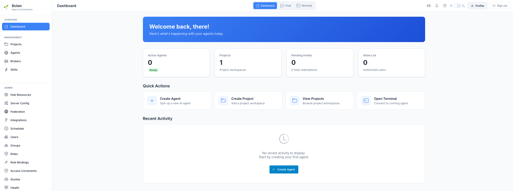

In the **Create Project** dialog:
1. Set **Name** to `drug-design-engine`.
2. Set **Workspace Type** to **Hub-managed Workspace** (*A workspace managed by the Hub. No git repository required.*).
3. Verify **Slug** is `drug-design-engine`.
4. Click **Create Project**.

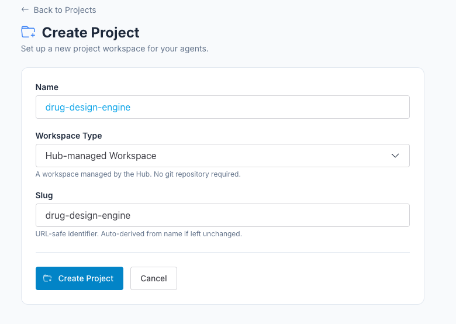

#### 3. Open Project Settings

Once the `drug-design-engine` workspace is created, click the **Settings** button in the top-right corner of the project overview page:

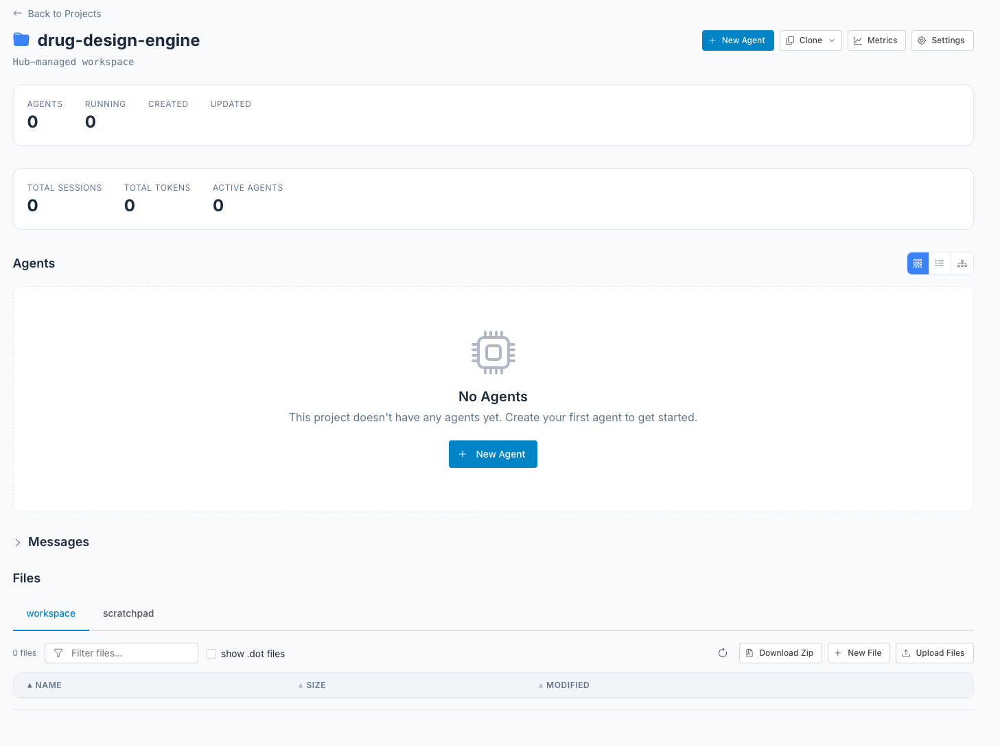

#### 4. Configure Default Harness to `antigravity`

In **drug-design-engine Settings**, under the **Configuration** -> **General** tab:
1. Set **Default Harness Config** to `antigravity (antigravity)` so new agents use the Antigravity harness by default.
2. Click **Save Configuration**.

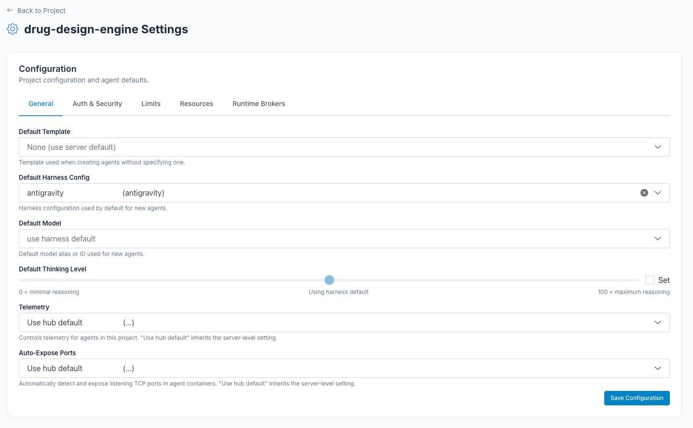

#### 5. Register the Existing GCP Service Account

Scroll down to the **Resources** section (*Project-scoped resources available to agents*) and select the **GCP Service Accounts** tab:
1. Click **+ Register Existing**:

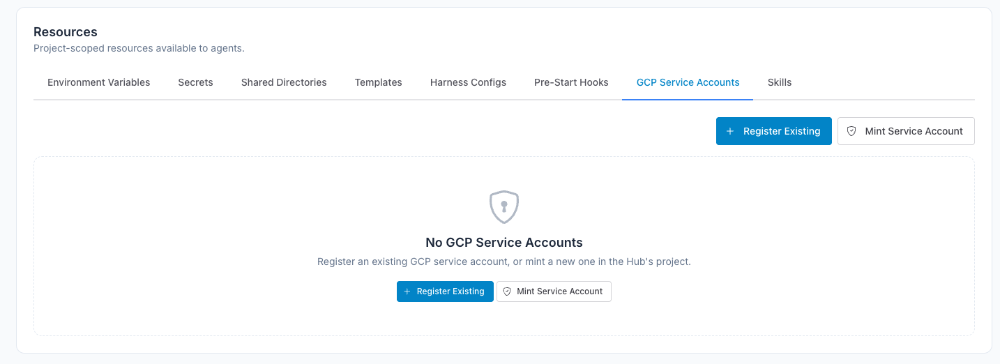

2. In the **Register GCP Service Account** dialog, enter your **Service Account Email** (`dde-agent-sa@<PROJECT_ID>.iam.gserviceaccount.com`). The **GCP Project ID** will be auto-detected from the email. Click **Register**:

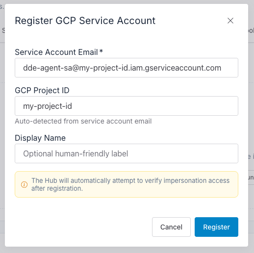

#### 6. Assign the Default Service Account in Auth & Security

Scroll back up to **Configuration** and select the **Auth & Security** tab:
1. Set **Default Service Account** to **Assign Service Account**.
2. Under **Service Account**, select the `dde-agent-sa@<PROJECT_ID>.iam.gserviceaccount.com` service account you registered.
3. Click **Save Configuration**.

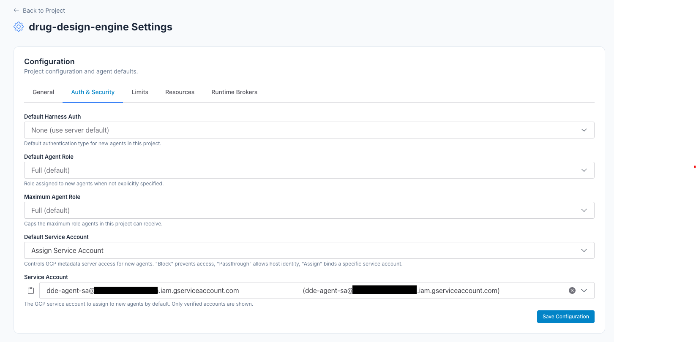

#### 7. Add the `tools` Shared Directory

In the **Resources** section, select the **Shared Directories** tab and click **+ Add Directory**:

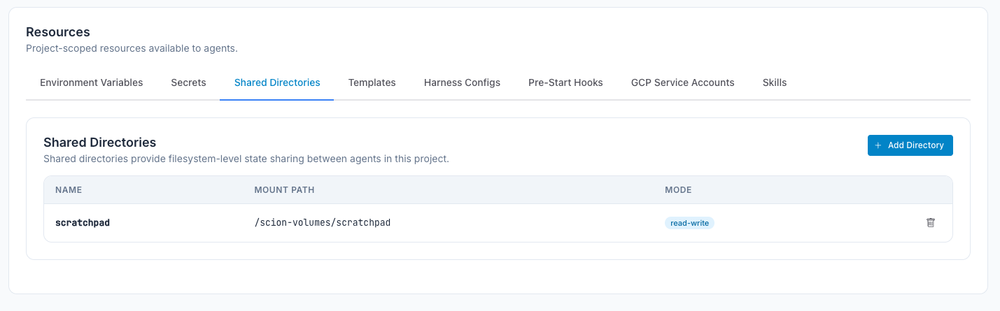

In the **Add Shared Directory** dialog, set **Name** to `tools` (leave **Read-only** and **Mount in workspace** unchecked so it mounts read-write at `/scion-volumes/tools`) and click **Create**:

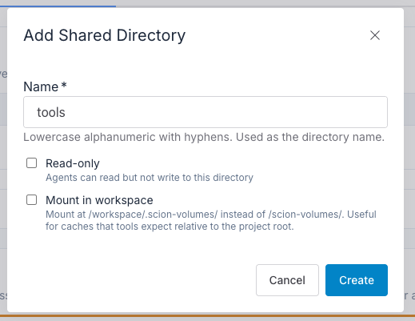

#### 8. Import Agent Templates

In the **Resources** section, select the **Templates** tab:
1. Select **Import from URL**.
2. Provide the GitHub URL for the DDE templates:
   ```text
   https://github.com/GoogleCloudPlatform/LifeSciences/tree/main/applications/drug-design-engine/templates
   ```

3. Click **Import Templates**:

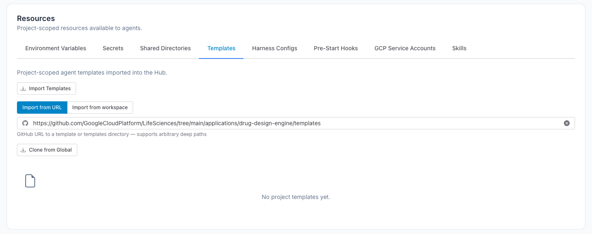

4. In the **Select Templates to Import** dialog, check **Select All** (`22 of 22 selected`) and click **Import Selected (22)**:

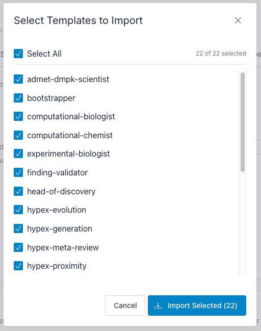

#### 9. Create and Start the `controller` Agent

1. In the left navigation sidebar under **MANAGEMENT**, select **Agents**:

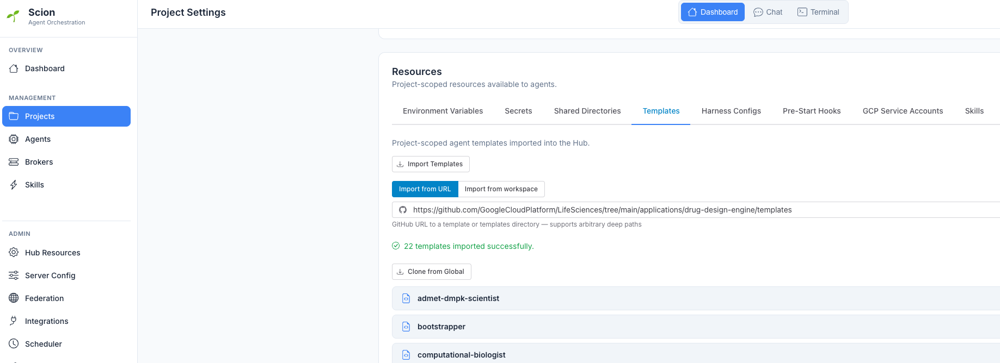

2. Click **+ Create Agent**:

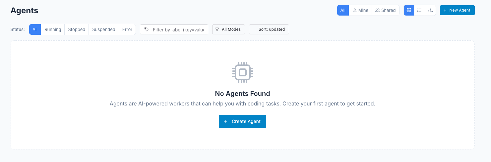

3. In the **Create Agent** form:
   - Set **Agent Name** to `controller`.
   - Confirm **Project** is `drug-design-engine`.
   - Set **Template** to `research-operations-controller (project)`.
   - Uncheck **Notify me on important agent state changes**.
   - Click **Start**:

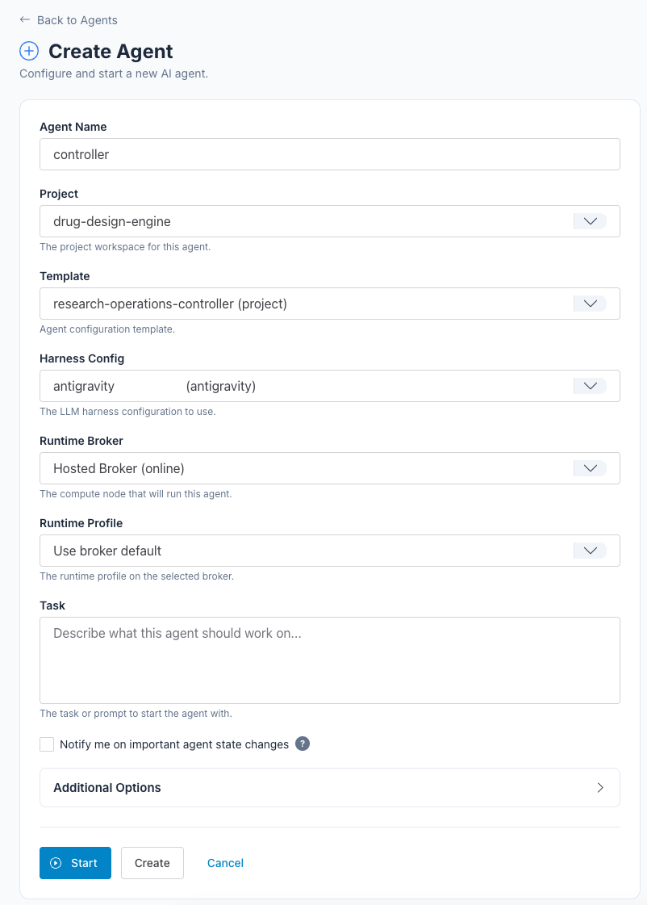

#### 10. Open Chat and Set `controller` as the Thread Default Agent

1. Once the `controller` agent is running, click **Chat** in the top navigation bar:

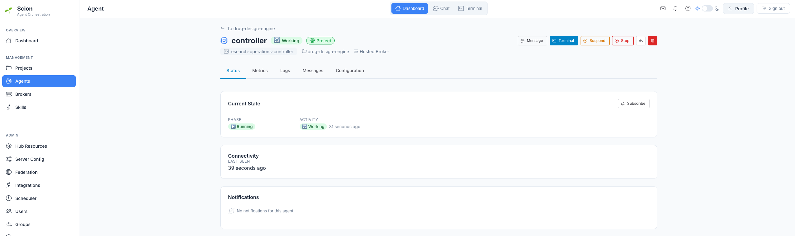

2. In the **Projects** panel on the left, expand **DRUG-DESIGN-ENGINE**, click the three dots (`⋮`) menu, select **+ NEW THREAD**, and name the thread `operations`:

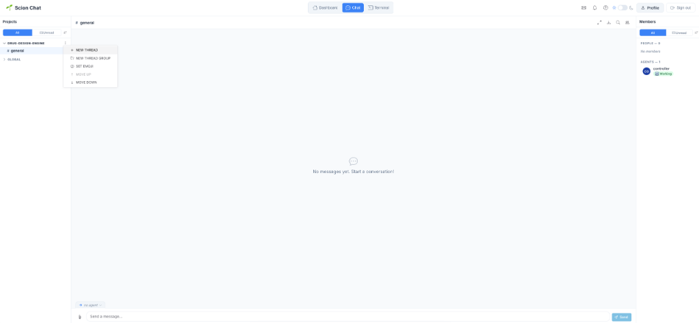

3. At the bottom-left of the chat panel (above the message input box), click **`no agent`** and select **`controller`** as the thread default agent:

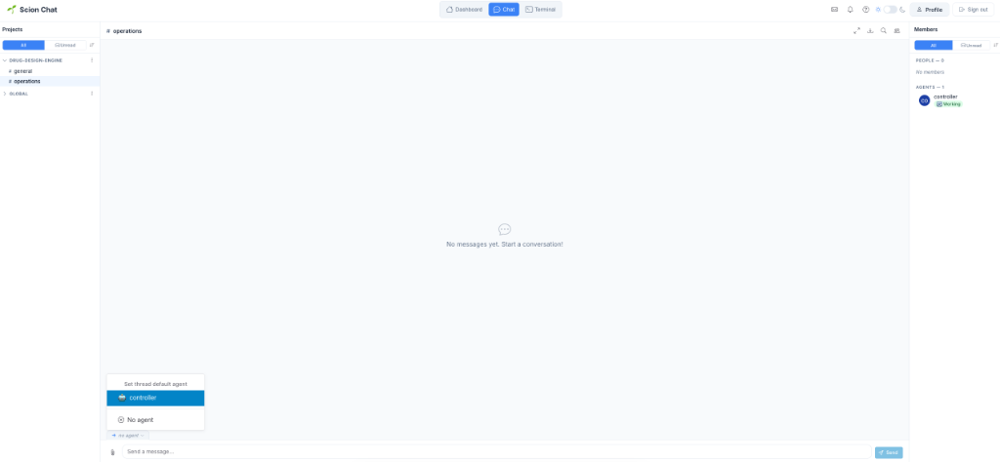

You can now message the `controller` directly in this thread with a program directive to bootstrap the tools environment and launch the Science Program Lead (see [`docs/quickstart-pilot.md`](docs/quickstart-pilot.md)).

---

## Project Status

The design is settled and recorded in the plan. The build is in progress.

**This section is the least trustworthy part of the README.** It is a cache of the
repository's contents, written on a date and revalidated by nobody, and it decays every
time a tool or skill lands. Do not plan from it. The repository answers the same
questions in ten seconds and cannot be stale:

```bash
ls skills/                                           # skills that exist
ls templates/                                        # agent templates that exist
grep -c uri: templates/*/scion-agent.yaml            # how many each template grants
grep -h uri: templates/*/scion-agent.yaml | sort -u  # which skills those are
dde doctor                                        # which tools are installed and callable
```

**If those disagree with anything below, they are right and this is stale.**

The `-c` line is there for a reason and should be run first. If the field were
renamed or the templates moved, the `sort -u` line would print nothing — and
nothing reads as *no template grants any skill*, a false statement about the
repository, rather than as *this command stopped working*. The `-c` form cannot
do that: it names every file it read and prints a count for each, so a rename
shows up as twelve zeros or as `No such file`, both of which are obviously the
instrument and not the repository. Prefer the form whose failure is loud.

The build order is the durable part, and it is a design statement rather than a status
report: **tooling, then skills, then templates.** A skill cannot name an invocation that
does not exist, and a template cannot grant a skill nobody has written. Work moves down
that order, never up.

**Snapshot — 2026-08-18, decays from that moment.** The pilot tools (co-scientist,
AlphaFold, AlphaGenome) are built, and further tool groups have landed since; `dde
doctor` lists what is actually callable. Nine skills exist. All twelve templates,
including the controller and the reviewer, grant dde capability skills — the earlier
state, in which templates granted upstream `science-skills` URIs directly, is gone.
Coverage is uneven by role rather than uniformly early: some roles hold several
capability skills, some hold one, and some hold none and will report blocked by design.

No number is given here for the last group, because the obvious way to count it is
wrong. `grep -c` counts *granted* skills, and every template is granted
`artifact-conventions`, which is a convention rather than a capability —
`program-state-management` likewise. A role showing `1` may hold no capability at all.
Read the URIs, not the counts, and decide per skill which kind it is. The per-role
picture is in each template's `scion-agent.yaml` and, for the planning view, in
`templates/science-program-lead/agents.md` §9.

The three guidance documents are v0.1. The pilot is expected to change them. See [dde-plan.md §10](docs/dde-plan.md).

## How It Works

```bash
# Create a Science Program Lead for a new research program
scion start program-lead --type science-program-lead

# Give it a scientific objective
scion message agent:program-lead "Investigate PCSK9 as a target for familial
hypercholesterolemia. Small molecule modality. Evaluate druggability and
advance through starting matter identification."
```

The Science Program Lead creates a Research Operations Controller, defines the initial decision questions, and commits work orders with immutable context snapshots. The controller initializes the project, supervises specialist runs, performs mechanical artifact validation, and keeps the presentation layer synchronized. The science lead accepts or rejects interpretations, maintains Layer 2 program state, and routes the work that follows.

## The Pipeline

### Stage 0: Hypothesis Entry

Before the four invariant stages begin, a program acquires its initial hypothesis set through one of four strategies: sponsor-supplied adoption, charter-authored hypotheses, a Co-Scientist tournament export, or a hypex tournament run within the program. Stage 0 is how a program acquires something to take into Stage 1.

### The Four Invariant Stages

DDE follows the pre-clinical drug discovery value chain. The stages are invariant and modality-independent. What happens within each stage is dynamic — which roles participate, which workflows execute, and how work is sequenced all depend on the evolving scientific context.

| Stage | Objective | Gate question |
|---|---|---|
| **1. Identify & Validate the Intervention Point** | Link a molecular intervention point to the disease and confirm it is tractable for the modality | Is the causal evidence sufficient, and is the intervention point tractable? |
| **2. Find Starting Matter** | Identify active entities that engage the intervention point, confirm activity, and remove artifacts | Do we have confirmed, tractable starting matter with a path to optimization? |
| **3. Multiparameter Optimization** | Evolve starting matter into entities that meet efficacy, safety, and developability needs together | Does an optimized entity meet all critical quality attributes? |
| **4. Demonstrate Human Readiness** | Produce the safety, efficacy, pharmacology, and regulatory package for first-in-human studies | Is the risk-benefit acceptable for human dosing? |

Gate criteria are named constants with program overrides in `.dde/thresholds.yaml`. Every analysis output records the threshold set it applied. Thresholds never live in prose, because prose cannot be enforced, versioned, or varied per program. See [dde-plan.md §3](docs/dde-plan.md) for the criteria and how they vary by modality.

## Agent Roles

Specialist roles are stage-agnostic. Each definition describes *who the specialist is*, not what stage-specific work it does. Stage-specific questions and context arrive through versioned work orders.

| Role | Description |
|---|---|
| **Science Program Lead** | Owns scientific work planning, evidence acceptance, Layer 2 state, and stage decisions. The only agent the user creates directly. Template: `science-program-lead`. |
| **Research Operations Controller** | Persistent controller for work-order execution, agent lifecycle, resource scheduling, artifact validation, and publication. |
| **Scientific Reviewer** | Independent evidence audit for gate-critical, high-impact, or disputed findings. |
| **Structural Biologist** | Protein structure prediction, druggability assessment, co-crystal SAR interpretation, selectivity engineering. |
| **Computational Biologist** | Genomic target nomination, GWAS fine-mapping, multi-omic analysis, variant interpretation. |
| **Computational Chemist** | Virtual screening, docking campaigns, FEP/RBFE calculations, ML ADMET prediction. |
| **Medicinal Chemist** | Hit tractability, scaffold selection, SAR-driven analog design, bioisostere strategy. |
| **Experimental Biologist** | CRISPR validation, HTS execution, dose-response, cellular potency assays, in vivo efficacy models. |
| **ADMET/DMPK Scientist** | Metabolic stability, CYP inhibition, permeability, in vivo PK, DDI risk assessment. |
| **Preclinical Toxicologist** | GLP toxicology study design, NOAEL determination, safety pharmacology, risk assessment. |
| **Regulatory Scientist** | IND dossier assembly, GLP compliance, CMC documentation, regulatory strategy. |
| **Project Curator** | Optional editorial role for executive narrative or new stakeholder views. Deterministic tools maintain site synchronization. |
| **Hypex Supervisor** | Runs DDE's bounded multi-epoch hypothesis-exploration subgraph and publishes its native datastore through `dde hypex ingest` and `analyze`. |

## Design Principles

Six principles shape the system. [dde-plan.md §2](docs/dde-plan.md) gives the reasoning behind each.

- **Do not re-teach the LLM what it knows.** Role templates give a persona trigger, a capability grant, and an output contract — not re-taught domain knowledge.
- **Invariant structure, dynamic content.** The four stages are fixed. Everything within them is selected by the Science Program Lead from the evolving context.
- **Separate reporting from reasoning.** Gate documents are retrospective deliverables. The science lead reasons against the living program state.
- **Ephemeral specialists, rich task context.** Each specialist receives an immutable work order with a bounded, checksummed context snapshot.
- **Computation in tools, judgment in skills.** Anything computable belongs in the CLI. Anything that is a threshold belongs in its configuration.
- **One scientific authority, separate operational control.** The controller executes; it cannot change a question, accept an interpretation, or advance a gate.

## Artifact Architecture

Project artifacts are organized into five layers of increasing abstraction:

| Layer | Name | Contents |
|---|---|---|
| **0** | Raw Tool I/O | Everything a tool writes: docking JSONs, RDKit descriptors, AlphaFold structures, assay CSVs, provenance sidecars, and analysis verdicts |
| **1** | Specialist Findings | The prose conclusion of a decision step — what a role concluded after weighing Layer 0 output against program context |
| **2** | Program State | The Science Program Lead's decision surface: active series, liabilities, decision log, open questions |
| **3** | Stage Gate Documents | Intervention Validation Package, Starting Matter Declaration, Candidate Nomination Dossier, Human Readiness Package |
| **4** | Executive Summary | One-page program status for portfolio-level stakeholders |

The boundary between Layer 0 and Layer 1 is the boundary between *computed* and *judged*. It makes review mechanical: a reviewer re-runs `analyze` against the stored artifact, diffs the result, then asks whether the finding's prose is supported by it.

Every factual claim in a report links to its supporting artifact — vertically to raw data, laterally to peer findings, or upward to program state. These links give both audit trails and the navigation structure for deterministic website and dashboard builds.

Orchestration records — work orders, run history, publication state — live in a separate control plane under `.dde/control/`. They are auditable, but they are not scientific citation sources.

## Repository Structure

```
dde/
├── templates/          # Scion agent templates, one directory per role
├── skills/             # DDE skills, one directory per capability
├── tools/              # The dde CLI and its environment
│   ├── BOOTSTRAP.md    # Blank directory to working CLI, incl. container prereqs
│   ├── bootstrap-preflight.sh   # Can this container build it? Run before install.sh
│   ├── install.sh      # Environment setup: venv, compiled binaries, ENV_VERSION
│   ├── requirements.txt
│   ├── vendor/hypex/  # Vendored Hypex source; binaries are built during provisioning
│   ├── pyproject.toml  # PEP 621 packaging; console_scripts entry point
│   └── dde/
│       ├── cli.py      # Click entry point; one command group per tool
│       ├── core/       # Project root, HTTP, provenance, thresholds, output
│       └── commands/   # One module per tool; phases as subcommands
├── docs/               # Design documents
├── LICENSE
└── README.md
```

[dde-plan.md §7](docs/dde-plan.md) shows the target structure, including the directories that steps 2 and 3 add.

Each agent template contains three files:

- **`scion-agent.yaml`** — schema, description, and the `skills:` capability grant
- **`system-prompt.md`** — persona trigger, 1-2 sentences
- **`agents.md`** — role instructions, questions owned, output contract

The `skills:` list is the only declaration of what an agent can do. A template must not restate it in prose, because a second copy drifts.

## Tools

The `tools/` directory holds the `dde` CLI. The CLI is the execution surface for every computation an agent performs. A specialist never computes a reported value itself. If a required tool is unavailable, the specialist reports the task as blocked rather than estimating.

Two rules shape every command:

- **Two phases.** `fetch` or `run` performs the expensive act and writes the artifact with a provenance sidecar. `analyze` reads that artifact from disk and applies named thresholds. The second phase re-runs without repeating the first — after a threshold change, or as a reviewer's fabrication check.
- **Everything a tool writes is Layer 0.** Tool output lands under `raw/`, resolved from `$DDE_PROJECT` or a `.dde/` marker, never from the working directory. Only a specialist writes to `findings/`.

### Bootstrapping a tools environment

**Starting from a blank directory in a fresh container, see
[`tools/BOOTSTRAP.md`](tools/BOOTSTRAP.md).** It covers what has to be
installed in the bootstrapper's *own* container before `install.sh` can
run — a C toolchain and the static archives, because `fpocket` is
compiled here rather than downloaded — and what to do when you lack the
privilege to install it. Run `tools/bootstrap-preflight.sh` first: it
writes nothing, needs no privilege, and prints the exact `apt-get` line
for whatever is missing, before anyone has waited fifteen minutes to
find out.

The summary below assumes an already-equipped container.

`install.sh` provisions a complete environment into a blank directory: a
venv, the pip stack, the compiled binaries (`vina`, a statically linked
`fpocket`), and the `ENV_VERSION` stamp. Three variables place it, and a
shared volume is the normal case — one environment several agents run
out of, rather than a copy each.

```bash
cd tools
DDE_VENV=/scion-volumes/tools/.venv \
DDE_BIN=/scion-volumes/tools/bin \
DDE_TOOLS_HOME=/scion-volumes/tools \
  ./install.sh
```

Omit all three and everything lands under `tools/` for a local checkout.
`install.sh` writes `env.sh` into the tools home, and **that is the file
to source — not the venv's `activate`**:

```bash
source /scion-volumes/tools/env.sh

dde init ~/my-program && export DDE_PROJECT=~/my-program
dde doctor
```

`env.sh` sets three things `activate` does not: `bin/` on `PATH`, so
`fpocket` and `vina` resolve; `DDE_TOOLS_HOME`, so the CLI reads the
stamp for *this* environment rather than a compiled-in default; and
`PYTHONDONTWRITEBYTECODE`, because agents share one `__pycache__` on a
shared volume. Activating the venv alone yields a working `dde` and a
silently degraded environment — missing binaries, and `unpinned-dev`
written into every artifact's provenance.

**Run `dde doctor` before trusting any result, and read its exit
code, not just its output.** It converts a missing tool from an invented
number into a blocked task, and it fails when the environment has
drifted from its own stamp or was provisioned from a commit nobody else
can fetch.

`install.sh` exits non-zero on a partial install (3 = science stack, 4 =
a declared binary missing) even though the CLI works, so provisioning
cannot be recorded as complete for an environment that is missing half
of what was asked for. It is safe to re-run; re-running is free and does
not churn `ENV_VERSION`.

### Changing the environment

An environment change partitions the program's artifacts: results either
side of it carry different `env_version` values and are not directly
comparable. Price the change before making it.

```bash
dde env plan      # what ENV_VERSION would become, and what differs
dde env show      # what it is now, and whether it still matches
dde env diff <before> [after]   # explain a partition after the fact
```

Command groups today: `alphafold`, `alphagenome`, `coscientist`,
`doctor`, `env`, `expression`, `genetics`, `init`, `litref`, `pocket`,
`relays`. The single-file CLI that predated the two-phase contract has
been deleted after all subcommands were ported to the two-phase model.
The silent-failure defect it contained is documented in
`docs/dde-plan.md` §8.1.

## Working in a shared checkout

Several agents may share one working tree and one git index at the same time
(`SCION_WORKSPACE_MODE=shared-plain`). Two consequences, both of which have already
cost work here:

- **Commit by explicit path: `git commit --only <paths> -m ...`.** `git add <path>`
  protects others from your *add*; it does nothing about your *commit*, which takes the
  whole index including anything someone else staged seconds earlier. One commit here
  swept two files belonging to another agent under an unrelated subject line, and the
  next would have taken nine. `--only` commits the named paths and leaves the rest of
  the index staged and intact.
- **`--only` takes those paths from the working tree, not from the index.** Verified,
  because it is the one place the flag is not simply a narrower `add`: if you staged
  part of a file and left the rest unfinished, `--only <that file>` commits the
  unfinished version too. Staging a subset of hunks protects you from `git commit`; it
  does not protect you from `git commit --only`. Check with `git diff -- <paths>` before
  committing, not `git diff --cached`.
- **Put the reasoning where it will be read, not in the commit message.** In a tree
  where authorship is not durable, a rationale in a commit message can quietly change
  owner or vanish with a sweep, and it is read during archaeology rather than while
  deciding. A rationale belongs at the distance the reader will be standing when the
  question occurs to them: in the docstring if it is read while editing, in the output
  string if it is read while deciding. `dde doctor`'s advisories carry the test that
  would retire them in the remedy field for exactly this reason — the same words in a
  commit message would be correct and unreachable.

Before assuming a file is unchanged, re-read it: `git status --porcelain` reflects
everyone. A clean run of your own commits is not evidence the practice is safe — it may
only mean nobody else was mid-stage at the time.

**The expensive version of this is not misattribution.** A swept file arriving under
someone else's subject line costs a commit message. What costs more is *your
half-finished edit going out under a commit that claims it was reviewed*, and then
pushed — the tree is shared, so an intermediate state you were still thinking about can
become the published state of the repository without you touching a key. So: prefer to
leave a file untouched until you can finish it in one pass, and if you must stop
mid-edit, either commit the coherent part by explicit path or expect the rest to be
adopted by whoever commits next.

## Design Documentation

- **[docs/dde-plan.md](docs/dde-plan.md)** — the source of truth: stages, roles, artifact architecture, repository structure, and the build sequence.
- **[docs/orchestration-design-guidance.md](docs/orchestration-design-guidance.md)** — normative for the authority model and the end-to-end orchestration contract: work orders, control state, agent lifecycle, validation, scientific acceptance, escalation, and publication.
- **[docs/skill-design-guidance.md](docs/skill-design-guidance.md)** — normative for writing dde skills. Skills own *when* to run something, *what* to run, *where* results land, and *what they mean*. Tools group into capabilities rather than one skill per tool, so skills stay specialist-neutral.
- **[docs/tool-design-guidance.md](docs/tool-design-guidance.md)** — normative for the tools environment, the CLI, and the artifact contract: two-phase invocation, provenance sidecars, threshold configuration, and output discipline.
- **[docs/pilot-handoff.md](docs/pilot-handoff.md)** — not normative, and the one to read first if you are inheriting this repository: what the first pilot can actually do, which refusals are designed behaviour rather than defects, and how to triage a report from a pilot team.

## Contributing

See [docs/contributing.md](docs/contributing.md).

## License

Apache 2.0 — see [LICENSE](LICENSE).
