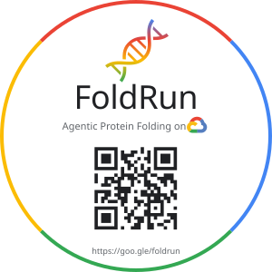

<table><tr>
<td width="160" valign="middle"><a href="https://youtu.be/umTLrEF5L7A"></a></td>
<td valign="middle"><strong>FoldRun</strong> is an AI-powered orchestration platform for biomolecular structure prediction on Google Cloud. It provides a conversational interface that manages the entire lifecycle — from sequence and ligand input to structural validation — using Gemini and Google Agent Runtime. Supports four structure prediction models (<strong>AlphaFold 2</strong>, <strong>AlphaFold 3</strong>, <strong>OpenFold 3</strong>, and <strong>Boltz-2</strong>) via a plugin architecture with shared infrastructure.</td>
</tr></table>

## Features

- **Conversational AI**: Natural language interface powered by Gemini for submitting, monitoring, and analyzing predictions
- **Multi-Model Support**: Plugin architecture for **AlphaFold 2**, **AlphaFold 3**, **OpenFold 3**, and **Boltz-2** — shared databases, unified KFP orchestration, and dedicated H100 endpoint management
- **4-Stage AF3 KFP Pipeline + Auto-Drain**: Orchestrates AlphaFold 3 predictions across 4 observable KFP stages (*Provision & Queue Endpoint $\rightarrow$ Run H100 Inference $\rightarrow$ Report Endpoint Available $\rightarrow$ Process Results & Expert Analysis*) with FIFO GCS replica slot locking and a 20-minute idle auto-undeploy watchdog (`$0.00/hr` when idle)
- **Automated Execution & Reservation-Aware Hardware**: Provisions infrastructure, detects GCE GPU reservations, and automatically falls back across GPU tiers (`H100_80GB` $\rightarrow$ `A100_80GB` $\rightarrow$ `A100` $\rightarrow$ `L4`)
- **Multimodal Gemini 3.1 Pro Expert Analysis**: Generates structural metrics (`pLDDT`, `PAE`, `pTM`, `ipTM`, `ranking_score`) and multimodal AI biological interpretation from 3D coordinates and plots
- **Interactive Visualization & Signed Artifact Bundles**: Web-based 3D structure viewer (3Dmol.js) with confidence coloring, PAE/ipTM heatmaps, and 1-click V4 signed ZIP archive downloads (`artifacts_bundle.zip`)
- **Smart Database Management**: YAML-driven downloads via Cloud Batch with GCS-based gap detection — shared databases downloaded once across models

## Supported Models

| Model | Source | Capabilities |
|-------|--------|-------------|
| [AlphaFold 2](https://github.com/google-deepmind/alphafold) | Google DeepMind | Protein monomers and multimers, AMBER relaxation |
| [AlphaFold 3](https://github.com/google-deepmind/alphafold3) | Google DeepMind | All-atom proteins, multimers, RNA, DNA (dsDNA), ligands (CCD codes & SMILES), metal ions (`MG`, `ZN`, `CA`, `FE`); Full 630 GB NVMe MSA + PDB templates or fast `--msa-free` screening |
| [OpenFold 3](https://github.com/aqlaboratory/openfold-3) | AQ Laboratory | Proteins, RNA, DNA, ligands (SMILES/CCD), full RNA MSA via `nhmmer` |
| [Boltz-2](https://github.com/jwohlwend/boltz) | MIT / jwohlwend | Proteins, RNA, DNA, ligands, covalent modifications, glycans, binding affinity |

## Tech Stack

- **Agent**: Google ADK with up to 36 native tools across 10 Skill packages (AF2 + AF3 + OF3 + Boltz-2), deployed to Agent Runtime
- **A2A**: Native Agent-to-Agent protocol integration for agent interoperability
- **AI**: Gemini 3.8 Flash (agent orchestration) & Gemini 3.1 Pro (multimodal structural expert analysis)
- **Compute**: Agent Platform Pipelines (KFP v2), Vertex AI Dedicated Endpoints (`a3-highgpu-1g` H100 80GB), Cloud Run, Cloud Batch
- **Storage**: GCS (artifacts, V4 signed bundles, AF3 630 GB MSA bundle), Filestore (NFS genetic databases)
- **Infrastructure**: Terraform, Cloud Build
- **Language**: Python 3.11+

## Getting Started

### Prerequisites

**Tools (install on your workstation):**
- [Google Cloud CLI](https://cloud.google.com/sdk/docs/install) with beta component:
  ```bash
  gcloud components install beta --quiet
  ```
- [Terraform](https://developer.hashicorp.com/terraform/install) (>= 1.0)
- [uv](https://docs.astral.sh/uv/getting-started/installation/) (Python package manager)

**GCP Project Requirements:**
- A GCP project with billing enabled
- The deploying user needs these IAM roles on the project:
  - `roles/owner` (simplest — covers all below), OR these granular roles:
  - `roles/editor` — create resources
  - `roles/iam.serviceAccountAdmin` — create service accounts
  - `roles/resourcemanager.projectIamAdmin` — grant IAM roles
  - `roles/artifactregistry.admin` — create Artifact Registry repos
  - `roles/serviceusage.serviceUsageAdmin` — enable APIs

**Shared VPC Requirements (if bringing your own network):**
If you are using a Shared VPC (network belongs to a host project), the following service accounts from this project need the **Compute Network User** (`roles/compute.networkUser`) role on the host project or specific subnet:
- `service-[PROJECT_NUMBER]@gcp-sa-cloudbatch.iam.gserviceaccount.com` (Cloud Batch Service Agent)
- `service-[PROJECT_NUMBER]@serverless-robot-prod.iam.gserviceaccount.com` (Cloud Run Service Agent, needed for Cloud Run Direct VPC egress)


**GPU Quota (check before starting):**
- **AlphaFold 3**: Default **1x NVIDIA H100 80GB (`a3-highgpu-1g`)** for Full 630 GB MSA + NVMe SSD (~3–6 min per standard target); automatically detects GCE reservations and falls back to **A100 80GB (`a2-ultragpu-1g`)**, **A100 40GB (`a2-highgpu-1g`)**, or **L4 (`g2-standard-16`, `--msa-free`)** if H100 quota/capacity is unavailable
- **AF2 minimum**: **1x NVIDIA A100 40GB** (L4 no longer auto-selected — slow DWS provisioning)
- **AF2 large proteins (>1500 residues)**: **1x NVIDIA A100 80GB**
- **OF3 minimum**: **1x NVIDIA A100 40GB** (no L4 support)
- **Boltz-2 minimum**: **1x NVIDIA A100 40GB** (no L4 support — diffusion model requires ≥40 GB VRAM)
- Check your quota: [GPU quota page](https://console.cloud.google.com/iam-admin/quotas?filter=gpu)
- If you need to request quota increases, do it first — approvals can take hours


### Step 1: Authenticate


```bash
# Login with your Google account
gcloud auth login

# Set Application Default Credentials (needed by the deploy script)
gcloud auth application-default login

# Set your project
gcloud config set project YOUR_PROJECT_ID
```

### Step 2: Deploy

From the `applications/foldrun/` directory:

```bash
cd applications/foldrun

# Deploy everything — no .env setup needed for fresh installs
./deploy-all.sh YOUR_PROJECT_ID
```

> **Note**: You do NOT need to create or edit a `.env` file for deployment.
> The deploy script and Cloud Build handle all configuration automatically.
> The `.env` file is only needed for [local development](#local-development).

The script will:
1. Enable GCP APIs and provision infrastructure (Terraform)
2. Build and deploy containers, viewer, analysis jobs, and agent (Cloud Build)
3. Ask how to set up genomic databases (see below)

**Database setup options** (the script asks interactively):

| Option | Time | Use when |
|--------|------|----------|
| 1. Download from internet | 2-4 hours | First-time setup, no existing backups |
| 2. Restore from GCS bucket | ~15 min | Colleague shared their bucket, or re-hydrating after rebuild |
| 3. Skip | 0 min | Deploy agent now, add databases later |

**Fast setup from a shared GCS bucket** (skip the interactive prompt):
```bash
GCS_SOURCE_BUCKET=source-project-foldrun-gdbs ./deploy-all.sh YOUR_PROJECT_ID
```

### Step 2b: Cross-Project Database Sharing (Optional)

If someone already has FoldRun deployed and wants to share their databases
with you, you can use their bucket as a source to speed up your deployment.
This requires provisioning your infrastructure first so the service account exists.

**1. Provision your infrastructure:**
```bash
./deploy-all.sh YOUR_PROJECT_ID --steps infra
```

**2. They grant your project read access to their databases bucket:**
They run this (replacing THEIR_PROJECT and YOUR_PROJECT_ID):
```bash
gcloud storage buckets add-iam-policy-binding gs://THEIR_PROJECT-foldrun-gdbs \
  --member="serviceAccount:batch-compute-sa@YOUR_PROJECT_ID.iam.gserviceaccount.com" \
  --role="roles/storage.objectViewer"
```

**3. Complete the deployment with the source bucket:**
```bash
GCS_SOURCE_BUCKET=THEIR_PROJECT-foldrun-gdbs ./deploy-all.sh YOUR_PROJECT_ID
```

### Step 2c: Shared VPC Configuration (Optional)

If you are deploying FoldRun into a Shared VPC (where the network belongs to a host project), follow these steps to ensure correct permissions:

**1. Create `terraform.tfvars`:**
In the `applications/foldrun/terraform/` directory, create a `terraform.tfvars` file with your network details:
```hcl
network_name           = "your-existing-vpc-name"
subnet_name            = "your-existing-subnet-name"
network_project_id     = "your-host-project-id"
network_project_number = "your-host-project-number"
```


**2. Enable Cloud Run API and Grant Permissions:**
Enable the Cloud Run API in your service project so that the Cloud Run Service Agent is created:
```bash
gcloud services enable run.googleapis.com --project=YOUR_PROJECT_ID
```
Then, grant the Cloud Run Service Agent the `Compute Network User` role on the host project or `roles/compute.networkUser` on the specific subnet and `roles/compute.networkViewer` on the host project:
```bash
gcloud projects add-iam-policy-binding HOST_PROJECT_ID \
  --member="serviceAccount:service-PROJECT_NUMBER@serverless-robot-prod.iam.gserviceaccount.com" \
  --role="roles/compute.networkUser"
```

**3. Provision your infrastructure (creates other service accounts):**
Run the deployment script with only the `infra` step:
```bash
./deploy-all.sh YOUR_PROJECT_ID --steps infra
```

**4. Grant IAM permissions on the Host Project:**
The previous step created the service account needed for the batch jobs. Now you must grant the Cloud Batch Service Agent the `Compute Network User` role on the host project or specific subnet.

Ask your host project administrator to run these commands (replacing `HOST_PROJECT_ID`, `SERVICE_PROJECT_ID`, and `PROJECT_NUMBER`):

```bash
gcloud compute networks subnets add-iam-policy-binding SUBNET_NAME \
  --region REGION \
  --member="serviceAccount:service-PROJECT_NUMBER@gcp-sa-cloudbatch.iam.gserviceaccount.com" \
  --role="roles/compute.networkUser" \
  --project HOST_PROJECT_ID
```

**5. Complete the deployment:**
Now run the deployment script regularly to build containers and deploy the application:
```bash
./deploy-all.sh YOUR_PROJECT_ID
```


### Other deploy options
```bash
./deploy-all.sh YOUR_PROJECT_ID --steps infra    # Only Terraform
./deploy-all.sh YOUR_PROJECT_ID --steps build    # Only Cloud Build (all containers)
./deploy-all.sh YOUR_PROJECT_ID --steps data     # Only database downloads
DOWNLOAD_MODE=full ./deploy-all.sh YOUR_PROJECT_ID  # Full BFD database (~272GB)

# Deploy and register the agent with a Gemini Enterprise app
./deploy-all.sh YOUR_PROJECT_ID --gemini-enterprise-app-id YOUR_GEMINI_ENTERPRISE_APP_ID
```

**Targeted rebuilds** — rebuild only what changed (much faster than full build):
```bash
# Rebuild just the OF3 container + redeploy agent (~10 min vs ~25 min full build)
./deploy-all.sh YOUR_PROJECT_ID --steps build --build-target of3

# Redeploy agent only — no container rebuilds (~3 min, e.g. after agent code change)
./deploy-all.sh YOUR_PROJECT_ID --steps build --build-target agent

# Rebuild the analysis job
./deploy-all.sh YOUR_PROJECT_ID --steps build --build-target analysis

# Rebuild multiple targets (comma-separated)
./deploy-all.sh YOUR_PROJECT_ID --steps build --build-target of3,viewer
```

Available `--build-target` values:

| Target | What rebuilds |
|--------|--------------|
| `all` | Everything (default) |
| `of3` | openfold3-components container + agent |
| `af2` | alphafold-components container + agent |
| `boltz2` | boltz2-components container + agent |
| `viewer` | foldrun-viewer Cloud Run service + agent |
| `agent` | Agent Runtime only (no container rebuilds) |
| `analysis` | foldrun-analysis-job Cloud Run Job only |

The agent is automatically redeployed whenever any non-analysis target is included.

**Pinned model versions** — override without editing any files:
```bash
# Override OpenFold3 image tag[@digest] (0.5+ requires OpenBind v0 weights via `--steps data --db of3_params`)
OF3_VERSION=0.5-pixi ./deploy-all.sh YOUR_PROJECT_ID --steps build --build-target of3

# Pin AlphaFold2 to a specific git commit
AF2_VERSION=abc123def ./deploy-all.sh YOUR_PROJECT_ID --steps build --build-target af2

# Upgrade Boltz-2
BOLTZ_VERSION=2.3.0 ./deploy-all.sh YOUR_PROJECT_ID --steps build --build-target boltz2
```

Default versions are defined in `deploy-all.sh` and match the tested, pinned values in each container's `Dockerfile`.

### Step 3: Verify

```bash
# Check all components are healthy (also prints live Reasoning Engine & A2A URLs)
./check-status.sh YOUR_PROJECT_ID
```

Expected output:
```
✅ [Terraform] Infrastructure provisioned
✅ [Cloud Run] foldrun-viewer service is deployed and active
✅ [Cloud Run] foldrun-analysis-job is deployed
✅ [Agent Platform] FoldRun Agent Runtime is deployed
   🔗 Reasoning Engine: projects/YOUR_PROJECT_NUMBER/locations/us-central1/reasoningEngines/YOUR_ENGINE_ID
   🔗 A2A Endpoint:     https://us-central1-aiplatform.googleapis.com/reasoningEngines/v1/projects/YOUR_PROJECT_NUMBER/locations/us-central1/reasoningEngines/YOUR_ENGINE_ID/api/a2a/foldrun_app
   🔗 A2A Agent Card:   https://us-central1-aiplatform.googleapis.com/reasoningEngines/v1/projects/YOUR_PROJECT_NUMBER/locations/us-central1/reasoningEngines/YOUR_ENGINE_ID/api/a2a/foldrun_app/.well-known/agent-card.json
✅ [Data] Databases present (12 folders)
   ✅ AF2 core databases (uniref90 etc.)
   ✅ OF3 weights + CCD
   ⚠️  Boltz-2 databases not downloaded (optional)
```

### Step 4: Use the Agent (Console, Gemini CLI, `a2a-cli`, and Antigravity `agy`)

#### 4a. Vertex AI Agent Runtime Playground

Open the Agent Runtime playground:
```
https://console.cloud.google.com/vertex-ai/agents/locations/YOUR_REGION/agent-engines/YOUR_ENGINE_ID/playground?project=YOUR_PROJECT_ID
```

The engine ID is printed at the end of `deploy-all.sh` (or `./check-status.sh YOUR_PROJECT_ID`) and saved in `foldrun-agent/deployment_metadata.json`.

**Try these prompts:**
- "Predict the structure of ubiquitin with AlphaFold 3" (AF3 monomer, ~3.8 min Full-MSA or ~58s `--msa-free`)
- "Fold this kinase domain with ATP and a Mg2+ ion in AlphaFold 3" (AF3 protein + CCD ligand + metal ion)
- "Predict EGFR kinase bound to Gefitinib SMILES `COc1cc2c(cc1OCCCN3CCOCC3)ncn2-c4cc(Cl)c(F)cc4` using AlphaFold 3" (AF3 protein + SMILES inhibitor)
- "Fold the Zif268 zinc-finger domain bound to dsDNA `GCGTGGGCG` / `CGCCCACGC` in AlphaFold 3" (AF3 protein + dsDNA duplex)
- "Predict this RNA aptamer `GGAUACCCUGAUGAGUCCGAAAGGACGAAACAGU` with AlphaFold 3 or OpenFold 3" (RNA monomer with `nhmmer` MSA)
- "Predict a glycoprotein-ligand complex with covalent modifications" (Boltz-2)
- "What's the structure of P69905?" (checks AlphaFold DB first)

---

#### 4b. Option 1 — Antigravity (`agy`) + `a2a-cli` (`a2a-foldrun` Wrapper)

Unlike the standalone `gemini` CLI, **Antigravity (`agy` / `jetski`) does not natively parse `kind: remote` A2A `agent_card_url` definitions**. Instead, `agy` connects to FoldRun's A2A endpoint through the official [`a2a-cli`](https://github.com/a2aproject/a2a-cli) via an authenticated `~/.local/bin/a2a-foldrun` wrapper (and optionally a local `agy` Markdown subagent):

```
┌────────────────────────────────────────────────────────┐
│               Developer / Terminal Shell               │
│                                                        │
│   ┌─────────────────────┐      ┌───────────────────┐   │
│   │ Antigravity (`agy`) │      │   `a2a-foldrun`   │   │
│   │  (Autonomous mode)  │◄────►│  (Wrapper Script) │   │
│   └─────────────────────┘      └─────────┬─────────┘   │
└──────────────────────────────────────────┼─────────────┘
                                           │
                                  A2A Protocol (JSON-RPC / SSE)
                            + Bearer $(gcloud auth print-access-token)
                                           │
                                           ▼
┌────────────────────────────────────────────────────────┐
│        Google Cloud Vertex AI Reasoning Engines        │
│                                                        │
│  Endpoint: .../reasoningEngines/<ENGINE_ID>/api/a2a/   │
│            foldrun_app                                 │
│                                                        │
│  Models Managed:                                       │
│   • AlphaFold 3 (4-Stage KFP + Dedicated H100 Endpoint)│
│   • AlphaFold 2 Monomer/Multimer (Vertex AI Pipelines) │
│   • OpenFold 3 & Boltz-2 (Vertex AI Pipelines)         │
│   • AlphaFold DB (EMBL-EBI direct lookups)             │
└────────────────────────────────────────────────────────┘
```

**1. Install `a2a-cli` persistently into `~/.local/bin`:**
```bash
mkdir -p ~/.local/bin
curl -sL "https://github.com/a2aproject/a2a-cli/releases/download/v0.3.0/a2a_0.3.0_linux_amd64.tar.gz" -o ~/.local/bin/a2a.tar.gz
tar -xzf ~/.local/bin/a2a.tar.gz -C ~/.local/bin a2a
chmod +x ~/.local/bin/a2a
ln -sf ~/.local/bin/a2a ~/.local/bin/a2a-cli
rm -f ~/.local/bin/a2a.tar.gz
a2a version
```

**2. Resolve and cache the FoldRun Agent Card locally:**
```bash
# Get your A2A Agent Card URL from ./check-status.sh YOUR_PROJECT_ID
export A2A_CARD_URL="https://YOUR_REGION-aiplatform.googleapis.com/reasoningEngines/v1/projects/YOUR_PROJECT_NUMBER/locations/YOUR_REGION/reasoningEngines/YOUR_ENGINE_ID/api/a2a/foldrun_app/.well-known/agent-card.json"

mkdir -p ~/.config/a2a
curl -s -H "Authorization: Bearer $(gcloud auth print-access-token)" \
  "$A2A_CARD_URL" -o ~/.config/a2a/foldrun-agent-card.json
```

**3. Create the `~/.local/bin/a2a-foldrun` authenticated wrapper:**

Because Vertex AI Reasoning Engine endpoints require Google Cloud OAuth access tokens (`gcloud auth print-access-token`), create a wrapper script that injects a fresh bearer token on every call:

```bash
cat << 'EOF' > ~/.local/bin/a2a-foldrun
#!/usr/bin/env bash
set -e

CARD_PATH="${A2A_FOLDRUN_CARD:-$HOME/.config/a2a/foldrun-agent-card.json}"
TOKEN="$(gcloud auth print-access-token)"

if [ "$#" -eq 0 ]; then
    echo "Usage: a2a-foldrun [flags] \"<message>\""
    echo "Examples:"
    echo "  a2a-foldrun \"What models do you support?\""
    echo "  a2a-foldrun --stream \"Check GPU quotas\""
    echo "  a2a-foldrun --stream \"Check AF3 endpoint status and queue depth\""
    echo "  a2a-foldrun card"
    exit 1
fi

if [ "$1" = "card" ]; then
    shift
    exec a2a card get "$CARD_PATH" --auth "Bearer $TOKEN" "$@"
fi

exec a2a send -a "$CARD_PATH" --auth "Bearer $TOKEN" "$@"
EOF

chmod +x ~/.local/bin/a2a-foldrun
```

**4. Example `a2a-foldrun` Commands:**

| Capability / Tool | Command | Outcome |
|---|---|---|
| **Inspect Agent Card** | `a2a-foldrun card` | Displays registered FoldRun skills and A2A interfaces |
| **GPU Quota & Reservations** | `a2a-foldrun --stream "check gpu quota and reservations"` | Polls regional H100/A100/L4 quota and open GCE reservations |
| **AF3 Endpoint & Queue Status** | `a2a-foldrun --stream "check af3 endpoint"` | Reports deployed H100 replicas, active/queued jobs, and scale-up advisories |
| **Job Monitoring** | `a2a-foldrun --stream "check job progress"` | Lists active/completed KFP runs across AF2, AF3, OF3, and Boltz-2 |
| **Results & Signed Bundles** | `a2a-foldrun --stream "get prediction results for af3_zinc_finger_dna"` | Returns `ranking_score`, `pLDDT`, `ipTM`, signed `.cif`/`.zip` URLs, and 3D Viewer link |

**5. Registering `foldrun` as a Reusable Antigravity (`agy`) Custom Agent (Optional):**

To make `agy --agent foldrun` (or subagent invocation inside `agy`) work out of the box without typing `a2a-foldrun` in every prompt, create `~/.gemini/config/agents/foldrun.md`:

````markdown
---
name: foldrun
description: "Protein & biomolecular structure prediction agent (AF2, AF3, OF3, Boltz-2) via the FoldRun Vertex AI Reasoning Engine A2A endpoint."
tools:
  - run_command
  - view_file
mainAgent: true
subagent: true
commandExecutionPolicy: auto
---

# FoldRun A2A Agent

Delegate all structure prediction, GPU quota/reservation checks, AF3 endpoint management, and result analysis queries to the deployed FoldRun Reasoning Engine via `~/.local/bin/a2a-foldrun`:

```bash
a2a-foldrun --stream "<query>"
```
````

And for unprompted headless execution in `agy`:
```bash
alias agy-yolo="agy --dangerously-skip-permissions --mode accept-edits"
agy-yolo --agent foldrun -p "Check active FoldRun pipeline jobs and summarize their status"
```

---

#### 4c. Option 2 — Standalone Gemini CLI (`kind: remote`)

If you are using the standalone open-source **Gemini CLI** (`gemini`, which supports `kind: remote` A2A agent cards natively), create `~/.gemini/agents/foldrun.md`:

```markdown
---
kind: remote
name: FoldRun
description: Agentic biomolecular structure prediction on Google Cloud (AF2, AF3, OF3, Boltz-2)
agent_card_url: https://YOUR_REGION-aiplatform.googleapis.com/reasoningEngines/v1/projects/YOUR_PROJECT_NUMBER/locations/YOUR_REGION/reasoningEngines/YOUR_ENGINE_ID/api/a2a/foldrun_app/.well-known/agent-card.json
auth:
  type: google-credentials
---
```

Then invoke directly:
```bash
gemini -a foldrun "Predict the structure of ubiquitin with AlphaFold 3"
```

### Step 5: Wait for Databases

Database downloads run as Cloud Batch jobs in the background. Structure predictions will fail until the required databases are available on NFS.

- **From GCS restore**: ~15 minutes
- **From internet**: 2-4 hours

Monitor progress:
```bash
gcloud batch jobs list --project=YOUR_PROJECT_ID --location=YOUR_REGION
```

Or check the [Cloud Batch console](https://console.cloud.google.com/batch/jobs).

### What Gets Created

| Resource | Name | Purpose |
|----------|------|---------|
| VPC + Subnet | `foldrun-network` | Private network for Filestore + pipelines |
| Filestore | `foldrun-nfs` | NFS for genetic databases (2.5TB Basic SSD) |
| GCS Bucket | `{project}-foldrun-data` | Pipeline outputs, AF3 results, analysis bundles |
| GCS Bucket | `{project}-foldrun-gdbs` | Genomic database backups + AF3 630 GB MSA bundle |
| Artifact Registry | `foldrun-repo` | Container images |
| Vertex AI Endpoint | `alphafold3-endpoint` | Managed AlphaFold 3 endpoint (`a3-highgpu-1g` H100 80GB, scales to `$0.00/hr` when idle) |
| Cloud Run Service | `foldrun-viewer` | 3D structure viewer (AF2 + AF3 + OF3 + Boltz-2) |
| Cloud Run Job | `foldrun-analysis-job` | Parallel prediction analysis (AF2 + OF3 + Boltz-2) |
| Service Account | `foldrun-agent-sa` | Agent's GCP identity |
| Agent Runtime | `FoldRun Assistant` | Deployed Gemini agent (via Cloud Build) |

### Local Development

```bash
cd foldrun-agent
cp .env.example .env   # Edit with your project settings
uv sync
uv run python foldrun_app/cli.py
```

For `adk web` (interactive UI):
```bash
cd foldrun-agent
uv run adk web foldrun_app
```

### Estimated Costs

| Component | Estimated Cost |
|-----------|---------------|
| Filestore (2.5TB Basic SSD) | ~$770/mo |
| GCS (~1TB database backups + AF3 630 GB MSA tar.gz) | ~$25/mo |
| Artifact Registry (~16GB) | ~$2/mo |
| Agent Runtime (idle) | ~$0 (pay per query) |
| Cloud Run (viewer, idle) | ~$0 (scale to zero) |
| **AlphaFold 3 endpoint (idle / undeployed)** | **$0.00/hr** (auto-undeploys after 20 min of inactivity) |
| **AlphaFold 3 prediction (`--msa-free`, H100)** | **~$0.18 per job** (~58s on warm `a3-highgpu-1g` at ~$11.06/hr) |
| **AlphaFold 3 prediction (Full 630 GB MSA, H100)** | **~$0.55–$1.15 per standard job** (~3–6 min for 30–350 aa/nt; ~$2.85–$3.55 for >1,100-aa proteins) |
| AF2 prediction (per job, A100) | ~$8 per job (MSA + 5 seeds predict + relax) |
| OF3 prediction (per job, A100) | ~$13 per job (MSA + 5 seeds predict) |
| Boltz-2 prediction (per job, A100) | ~$13 per job (MSA + 5 seeds predict) |
| Gemini 3.1 Pro API (per expert analysis) | ~$0.01-0.05 per analysis |

The dominant fixed cost is Filestore (~$770/mo). Current databases (AF2 reduced + OF3) use ~944 GB of the 2.5 TB provisioned, leaving room for the full BFD database (~272 GB) if needed. AlphaFold 3 mounts its 630 GB MSA bundle directly onto the H100 VM's 3 TB local NVMe SSD at endpoint startup and automatically undeploys back to `$0.00/hr` after 20 minutes of inactivity.

## Project Structure

```
foldrun/
├── foldrun-agent/              # AI Agent (Google ADK)
│   ├── foldrun_app/
│   │   ├── agent.py            # Agent definition (Gemini + SkillToolset)
│   │   ├── core/               # Shared infrastructure (model-agnostic)
│   │   │   ├── base_tool.py    # BaseTool (GCS, Agent Platform, NFS)
│   │   │   ├── config.py       # GCP project, NFS, GCS config
│   │   │   ├── download_artifacts.py # V4 Signed URL artifact & ZIP bundle generator
│   │   │   ├── hardware.py     # GPU quota & GCE reservation auto-detection + fallback
│   │   │   ├── batch.py        # Cloud Batch job submission
│   │   │   ├── download.py     # YAML-driven database downloader
│   │   │   └── model_registry.py
│   │   ├── models/
│   │   │   ├── af2/            # AlphaFold2 plugin
│   │   │   │   ├── config.py   # AF2Config (image, viewer URL, parallelism)
│   │   │   │   ├── base.py     # AF2Tool (GPU tiers: L4/A100/A100_80GB + relax)
│   │   │   │   ├── pipeline/   # KFP: Configure → Data → ParallelFor[Predict → Relax]
│   │   │   │   ├── tools/      # 19 tools (submit, status, analysis, viewer, DB queries)
│   │   │   │   └── utils/      # FASTA validation, pipeline utils
│   │   │   ├── af3/            # AlphaFold 3 plugin (4-stage KFP + Managed H100 Endpoint)
│   │   │   │   ├── config.py   # AF3Config (endpoint ID, H100/A100/L4 auto-fallback, reservations)
│   │   │   │   ├── base.py     # AF3Tool base class
│   │   │   │   ├── pipeline.py # 4-stage KFP DAG (Queue → Inference → Release → Expert Analysis) + Idle Watchdog
│   │   │   │   ├── tools/      # 7 tools: submit, submit_batch, check/deploy/undeploy_endpoint, get_results, open_viewer
│   │   │   │   └── utils/      # Input converter (FASTA/JSON), metrics, multimodal viewer_artifacts
│   │   │   ├── of3/            # OpenFold3 plugin
│   │   │   │   ├── config.py   # OF3Config (image, params path, viewer URL)
│   │   │   │   ├── base.py     # OF3Tool (GPU tiers: A100/A100_80GB, no relax)
│   │   │   │   ├── pipeline/   # KFP: ConfigureSeeds → MSA+templates → ParallelFor[Predict]
│   │   │   │   ├── tools/      # submit (use_templates=True default), analyze, get_results, open_viewer
│   │   │   │   └── utils/      # Input converter (FASTA→OF3 JSON), pipeline utils
│   │   │   └── boltz2/         # Boltz-2 plugin
│   │   │       ├── config.py   # BOLTZ2Config (image, cache path)
│   │   │       ├── base.py     # BOLTZ2Tool (GPU tiers: A100/A100_80GB only)
│   │   │       ├── pipeline/   # KFP: ConfigureSeeds → MSA(protein) → ParallelFor[Predict]
│   │   │       ├── tools/      # submit, analyze, get_results, open_viewer
│   │   │       └── utils/      # Input converter (FASTA→Boltz-2 YAML), pipeline utils
│   │   └── skills/             # ADK FunctionTool wrappers & SKILL.md packages
│   │       ├── job_submission/  # submit_af2_*, submit_af3_*, submit_of3_prediction, submit_boltz2_prediction
│   │       ├── job_management/  # status, list, details, delete, GPU quota, AF3 endpoint lifecycle
│   │       ├── results_analysis/ # AF2 + AF3 + OF3 + Boltz-2 analysis, V4 signed downloads
│   │       ├── visualization/  # AF2 + AF3 + OF3 + Boltz-2 viewer tools
│   │       └── _tool_registry.py
│   ├── databases.yaml          # Database manifest (all models)
│   ├── scripts/setup_data.py   # CLI for database downloads
│   └── tests/                  # 667+ unit tests
├── src/
│   ├── alphafold-components/    # AF2 pipeline container
│   ├── openfold3-components/    # OF3 pipeline container
│   ├── boltz2-components/       # Boltz-2 pipeline container
│   ├── foldrun-viewer/          # Cloud Run web app (AF2 + AF3 + OF3 + Boltz-2 3D viewer)
│   └── foldrun-analysis-job/    # Cloud Run Job (Unified prediction analysis)
├── terraform/                   # Infrastructure as code
├── cloudbuild.yaml              # CI/CD pipeline
├── deploy-all.sh                # One-command deployment
└── check-status.sh              # Deployment health check
```

## Architecture

```
                      ┌──────────────────┐
   A2A clients ──→    │  foldrun-agent   │ ← Exposes native A2A endpoints (/api/a2a/foldrun_app)
                      │  (Agent Runtime)  │   Conversational AI (Gemini + 36 Tools across 4 Models)
                      └───────┬──────────┘
                              │ Native tool calls
        ├──→ Agent Platform Pipelines  ← AF2 + AF3 (4-stage KFP) + OF3 + Boltz-2 orchestration
        ├──→ Vertex AI H100 Endpoint   ← AlphaFold 3 (a3-highgpu-1g + 630 GB NVMe MSA + 20m auto-drain)
        ├──→ Cloud Batch               ← Genetic database downloads
        ├──→ Cloud Run Jobs            ← Parallel analysis + Gemini 3.1 Pro multimodal expert analysis
        └──→ Cloud Run Service         ← Interactive 3D viewer & V4 signed ZIP bundle downloads
```

## Why FoldRun vs ColabFold / Public Servers

Public tools like ColabFold and AlphaFold Server are great for academic research
but don't meet enterprise requirements for drug discovery pipelines:

| | ColabFold / AF Server | FoldRun |
|---|---|---|
| **Data sovereignty** | Sequences sent to external servers | Everything stays in your GCP project — VPC, no egress |
| **Small-molecule SMILES & custom ligands** | AlphaFold Server restricts arbitrary SMILES | Full support for custom SMILES inhibitors, CCD cofactors, ions, dsDNA & RNA in AF3, OF3, and Boltz-2 |
| **MSA computation** | ColabFold MMseqs2 server (external) | Local Jackhmmer/nhmmer on NVMe SSD (AF3 630 GB) or Filestore NFS |
| **Audit trail** | None | Full Agent Platform pipeline lineage, Cloud Logging |
| **IP protection** | No control over sequence retention | Your GCS bucket, your retention policies |
| **Regulatory** | Not GxP-compatible | Runs in your compliant GCP org with IAM controls |
| **GPU control** | Shared / queued | Dedicated H100/A100s with reservation detection, auto-fallback & 20m idle auto-drain |
| **Multi-model** | AF2 only (ColabFold) or AF3 only (AF Server) | **AF2 + AF3 + OF3 + Boltz-2** via unified plugin architecture |
| **Customization** | Fixed parameters | Full control: GPU tier, Full-MSA vs `--msa-free`, seeds, samples |
| **Scale** | Rate-limited (daily job quota) | Unlimited batch KFP queueing across warm H100 replicas |
| **Integration** | Web UI only | Conversational AI agent, A2A API, CI/CD, Gemini 3.1 Pro multimodal analysis |

**Bottom line**: FoldRun is built for the pharma/biotech use case where proprietary
sequences (pre-clinical targets, engineered antibodies, novel drug candidates) must
never leave the organization's cloud boundary. Every step — MSA search, structure
prediction, analysis — runs within your GCP project on your infrastructure.

## Genetic Databases

All database definitions live in [`databases.yaml`](foldrun-agent/databases.yaml). The downloader
is model-aware — shared databases (uniref90, mgnify, etc.) are tagged with multiple models and
downloaded once. Installing OF3 after AF2 only downloads the OF3-specific data.

### Managing databases

```bash
cd foldrun-agent

# Check what's downloaded vs missing (per model)
uv run python scripts/setup_data.py --status

# Preview what would be downloaded for OF3
uv run python scripts/setup_data.py --models of3 --dry-run

# Download OF3 data (skips shared DBs already present from AF2)
uv run python scripts/setup_data.py --models of3

# Download Boltz-2 data (weights + CCD mols, plus shared protein MSA databases)
uv run python scripts/setup_data.py --models boltz

# Download AF2 reduced set
uv run python scripts/setup_data.py --models af2 --mode reduced

# Download everything for all models
uv run python scripts/setup_data.py --models af2,of3,boltz

# Re-download a specific database
uv run python scripts/setup_data.py --db uniref90 --force

# List all available databases
uv run python scripts/setup_data.py --list
```

### Database layout on NFS

```
/mnt/nfs/foldrun/
  uniref90/              # Shared (AF2, OF3, Boltz-2)
  mgnify/                # Shared (AF2, OF3, Boltz-2)
  pdb_seqres/            # Shared (AF2, OF3) — also used for OF3 template search
  uniprot/               # Shared (AF2, OF3)
  pdb_mmcif/             # Shared (AF2, OF3) — CIF structures for OF3 template featurization
  alphafold2/params/     # AF2 only
  small_bfd/             # AF2 only
  pdb70/                 # AF2 only
  of3/params/            # OF3 only (~2GB OpenBind v0 weights: of3-ob-2025-06-30-174k.pt)
  of3/ccd/               # OF3 only (~500MB Chemical Component Dictionary)
  of3_msas/              # OF3 runtime — per-job MSA + template alignment files (auto-created)
  rfam/                  # OF3 only (RNA MSA via nhmmer)
  rnacentral/            # OF3 only (RNA MSA via nhmmer)
  boltz2/cache/          # Boltz-2 only — boltz2_conf.ckpt, boltz2_aff.ckpt, mols/ (CCD)
```

Monitor download progress in the [Cloud Batch console](https://console.cloud.google.com/batch/jobs).

### MSA Methods: Jackhmmer (default) vs MMseqs2 (optional)

FoldRun defaults to **Jackhmmer** (CPU-based) for MSA generation. This works
out of the box with the downloaded FASTA databases and produces high-quality
alignments. For most use cases, this is the right choice.

**MMseqs2 GPU-accelerated search** is available as an opt-in for AF2 only.
It requires a one-time index conversion step (~3-4 hours) but can speed up
MSA search significantly for specific workloads.

**When to consider MMseqs2:**
- Predicting **very large proteins** (>1000 residues) where Jackhmmer against
  full BFD takes hours
- **Batch screening** hundreds of sequences where MSA time dominates
- You're using `use_small_bfd=True` (MMseqs2 only works with FASTA databases)

**When Jackhmmer is fine (most cases):**
- Typical proteins (<500 residues) — MSA completes in 15-30 min on CPU
- The GPU predict step is the real bottleneck, not MSA
- You want to avoid the index conversion setup step
- You're using OF3 or Boltz (MMseqs2 not supported for these models)

To enable MMseqs2 for AF2, first build the indexes, then set `msa_method='mmseqs2'`
when submitting predictions. See the agent's help for details.

## Running Tests

```bash
cd foldrun-agent

# Unit tests (no GCP credentials needed)
uv run pytest tests/unit/ -v

# Integration tests (requires ADC and Gemini API access)
uv run pytest tests/integration/ -v -m integration
```

## License

Apache 2.0
