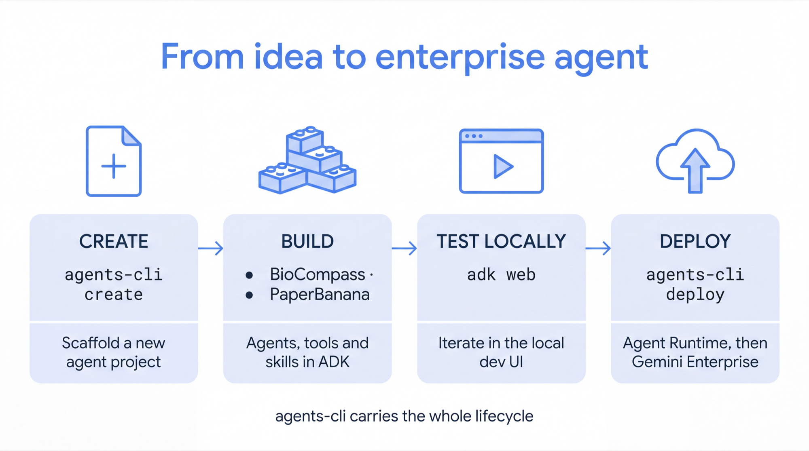

# Gemini Enterprise Agent Hackathon Kit

Everything you need to go from a laptop to a **custom agent running inside
[Gemini Enterprise](https://cloud.google.com/gemini-enterprise)** — in one day.

You'll start from two proven open-source agents, run them locally, deploy them to
the [Gemini Enterprise Agent Platform](https://cloud.google.com/products/gemini-enterprise-agent-platform),
and then build something of your own.



That line is the whole day. Every doc in this repo is one box on it.

---

## Start here

You do not need to read this repo end to end. Follow the steps in order — each
one is short, and each one ends with something working. Step 5 is optional, and
only if you have to show this to someone.

> **The two reference agents live next door** —
> `../biocompass-on-gemini-enterprise/` and
> `../paperbanana-on-gemini-enterprise/` — so you can point `adk web` straight at
> them instead of fetching. `scripts/get-agents.sh` exists for the standalone
> case, where a participant has cloned only this kit. This kit publishes with the
> rest of the monorepo to
> [GoogleCloudPlatform/LifeSciences](https://github.com/GoogleCloudPlatform/LifeSciences/tree/main/applications/pharma-on-gemini-enterprise/ge-agent-hackathon).

| Step | Doc | You'll finish with |
| --- | --- | --- |
| 0 | [Prerequisites](docs/00-prerequisites.md) | Accounts, tools and access verified by a script |
| 1 | [Environment setup](docs/01-environment.md) | The agents cloned and their dependencies installed |
| 2 | [Run locally](docs/02-run-locally.md) | An agent answering you in the ADK dev UI |
| 3 | [Deploy](docs/03-deploy.md) | That same agent live in your Gemini Enterprise app |
| 4 | [Build your own](#build-your-own) | Your own agent, scaffolded with `agents-cli create` |
| 5 | [Demoing these agents](docs/05-demo-guide.md) | A rehearsed demo — prompts, timings, and what to do when it breaks |
| 6 | [Interactive agents with A2UI](docs/06-interactive-agents-a2ui.md) | An agent that returns clickable UI in Gemini Enterprise, not just text |

If something breaks — and something will — go straight to
**[Troubleshooting](docs/04-troubleshooting.md)**. It is not a generic FAQ. Every
entry is a failure that actually happened, with the error text you'll see and the
fix. Reading it first will save you an afternoon.

---

## What's in the box

### `agents/` — two proven agents to start from

Both are Apache-2.0, from
[GoogleCloudPlatform/LifeSciences](https://github.com/GoogleCloudPlatform/LifeSciences/tree/main/applications/pharma-on-gemini-enterprise).
`scripts/get-agents.sh` fetches them and applies the small set of fixes this kit
maintains (see [Troubleshooting](docs/04-troubleshooting.md) for why each is needed).

| Agent | What it does | Why it's a good starting point |
| --- | --- | --- |
| **BioCompass** | Citation-grounded literature research. Searches PubMed, Europe PMC, bioRxiv/medRxiv and ClinicalTrials.gov **in parallel**, maps entities via PubTator3, and ships six methodology skills. | The best example of a **coordinator that routes**, a **parallel worker fan-out**, and a **critic loop** that checks citations before you see them. |
| **PaperBanana** | Attach a paper PDF, describe the figure you want, get a publication-style 4K image back. Plan → stylize → render → critique → refine. | Shows how to wrap a **multi-step pipeline as a single tool** so Gemini Enterprise renders one clean answer, and how **follow-up turns edit** rather than redraw. |

### Build your own

Once one of the agents above is running and deployed, you have the whole loop.
Scaffold your own from nothing:

```bash
agents-cli create my-agent
cd my-agent && adk web .          # iterate locally
agents-cli deploy                 # to the Agent Platform
agents-cli publish gemini-enterprise
```

The two agents above are the reference implementations — copy the shape that
fits. BioCompass if your problem is *gather from several sources and be able to
prove every claim*; PaperBanana if it's *a multi-step pipeline that should look
like one clean answer*.

### `scripts/` — the boring parts, automated

| Script | What it does |
| --- | --- |
| `preflight.sh` | Checks every tool, API and permission **before** you waste time |
| `setup-ge.sh` | Enables APIs, creates a Gemini Enterprise app and its assistant |
| `get-agents.sh` | Fetches BioCompass and PaperBanana, applies this kit's fixes |
| `deploy.sh` | Wraps `agents-cli` with the gotchas already handled |

### `tools/video-clipper/` — turn a screen recording into a narrated demo

You'll finish the day with a working agent and a messy screen capture. This turns
the second into a ninety-second narrated video: Gemini picks the clips, drafts the
talk track, and speaks it timed to what's on screen. Model IDs live in `.env`, and
[`AGENT-INSTRUCTIONS.md`](tools/video-clipper/AGENT-INSTRUCTIONS.md) lets any coding agent drive it.
See [tools/video-clipper](tools/video-clipper/).

---

## The toolchain

Three things do all the work. Worth knowing which is which:

| Tool | What it's for | Link |
| --- | --- | --- |
| **ADK** (Agent Development Kit) | The framework you write agents in — agents, tools, skills, orchestration | [google/adk-python](https://github.com/google/adk-python) · [docs](https://google.github.io/adk-docs/) |
| **`adk web`** | The local dev UI. Run your agent, watch every tool call and routing decision in the trace | comes with ADK |
| **`agents-cli`** | Scaffold, evaluate, deploy and publish. Two commands take you from laptop to Gemini Enterprise | [google/agents-cli](https://github.com/google/agents-cli) |

And two products underneath them:

- **[Gemini Enterprise](https://cloud.google.com/gemini-enterprise)** — the app your users actually open. Your agent shows up in its sidebar next to everything else.
- **[Gemini Enterprise Agent Platform](https://cloud.google.com/products/gemini-enterprise-agent-platform)** — the managed runtime, registry, gateway and observability your agent runs on.

---

## The shortest possible version

If you only remember one thing, remember this shape:

```bash
# build it locally, watch it work
uv sync
adk web .

# ship it
agents-cli deploy  --project=$PROJECT --region=us-central1
agents-cli publish gemini-enterprise \
    --agent-runtime-id="projects/$NUM/locations/us-central1/reasoningEngines/$ID" \
    --gemini-enterprise-app-id="projects/$NUM/locations/global/collections/default_collection/engines/$APP" \
    --registration-type=adk
```

Iterating? **Same deploy command, same `--service-name`** — it updates the
existing engine in place, so your Gemini Enterprise registration keeps working
and you don't burn Agent Runtime quota. Publish once, deploy as often as you
like. See [Updating an agent](docs/03-deploy.md#updating-an-agent-youve-already-deployed).

That's it. Everything else in this repo is detail around those four commands.

---

## Also useful

- [Healthcare MCP servers](https://github.com/GoogleCloudPlatform/hcls-mcp-servers) — ten open-source MCP servers giving agents structured access to PubMed, ClinicalTrials.gov, openFDA, RxNorm, UMLS, CMS and more. Apache-2.0.
- [LifeSciences applications](https://github.com/GoogleCloudPlatform/LifeSciences/tree/main/applications) — more reference agents: FoldRun (protein structure), Sentinel (regulated content review), Model Garden (third-party model bridge).
- [ADK sample agents](https://github.com/google/adk-samples)

## Licence

Apache-2.0 — see [LICENSE](../../../LICENSE). Third-party code fetched by
`scripts/get-agents.sh` remains under its own licence; see [NOTICE](NOTICE).

**Not an officially supported Google product.** These are demonstration and
starter materials. Nothing here has been clinically validated, and no output
should be treated as medical advice.
