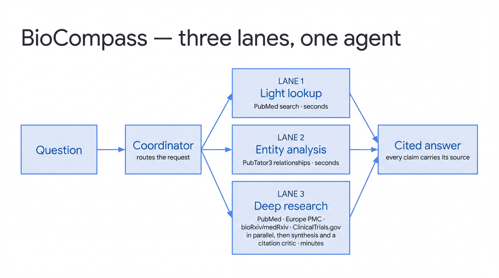
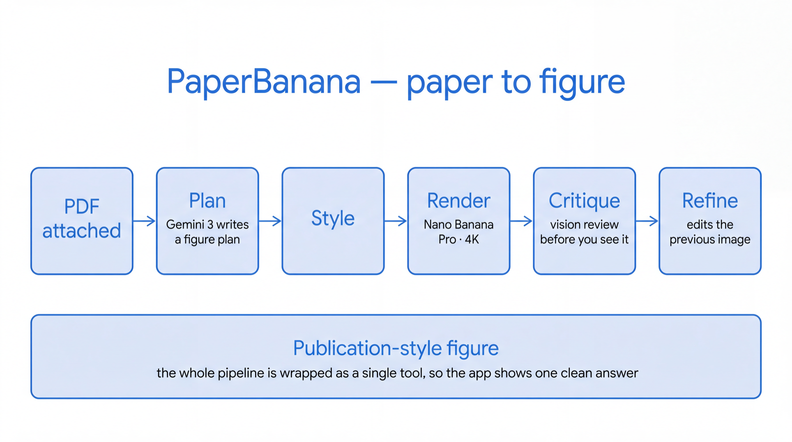

# 2 · Run locally

**Time: 15 minutes.** You'll finish with an agent answering you, and — more
usefully — with a clear view of *how* it answered.

---

## Start the dev UI

From an agent directory:

```bash
cd agents/biocompass
uv run adk web . --port 8501
```

Open **http://127.0.0.1:8501** and pick **`app`** from the dropdown. (`tests`,
`terraform` and similar entries are folders, not agents — ignore them.)

Running two agents at once? Give them different ports:

```bash
cd agents/paperbanana && uv run adk web . --port 8502
```

---

## Ask BioCompass something



Start with a narrow question:

```
Find recent published trials of sotorasib in KRAS G12C-mutant NSCLC.
```

**Open the trace panel and watch what happens.** You should see something like:

```
root_agent          -> transfer_to_agent
literature_search_agent -> advanced_search
literature_search_agent -> search_pubmed
                    -> cited answer
```

That's roughly 30 seconds, and it's the whole design in one screen: a coordinator
read the question, decided it was a **light lookup**, and handed off to a
sub-agent instead of running the expensive path.

Now ask something broader:

```
My patient is 62 with metastatic KRAS G12C NSCLC, progressed on first-line
pembrolizumab + platinum. Second-line options, and toxicities to counsel on?
```

The trace changes to `root_agent -> DeepResearchPipeline`, and it takes **two to
three minutes** — four sources in parallel, then synthesis, then a citation critic.

### The lesson worth taking away

Same agent, same citations, wildly different cost. The coordinator's routing
instruction says, roughly, *"default to deep when the answer needs more than a
single PubMed page."* That one sentence is the difference between 30 seconds and
3 minutes.

**Routing is model-driven, so it is not deterministic.** The same question can
take different lanes on different runs. If you're demoing, phrase the fast one as
an explicit lookup ("find recent papers on…") and rehearse it.

---

## Ask PaperBanana something



Attach a PDF in the composer, then:

```
Draw the study design for this trial — the arms, the dosing, and the primary endpoint.
```

About 90 seconds to a 4K figure. Then ask for **one change**:

```
Make the treatment arm clearer.
```

Notice it edits the previous image rather than redrawing from scratch. That's the
whole point of the refine loop, and it's the thing people remember.

---

## Why the dev UI matters

You could call these agents over HTTP. Use `adk web` anyway while you're building:

- **You see the routing.** Which sub-agent, which tool, in what order.
- **You see the tool arguments.** Most "the agent is wrong" bugs are actually "the agent called the tool with bad arguments".
- **Latency becomes legible.** A three-minute run with a visible trace reads as *working hard*. The same three minutes behind a spinner reads as *broken*.

> **One sharp edge:** `adk web` has **no client-side timeout**. If a model call
> hangs, the turn will sit there indefinitely — we've seen a single call hang for
> 15 minutes. If the log stops scrolling for a minute, abandon the turn and
> resubmit. It won't recover on its own.

---

## Iterate

Edit `app/agent.py`, save, and `adk web` picks it up on the next turn. Things
worth trying while you're here:

- Change the coordinator's routing instruction and watch lane selection change
- Add a tool and see it appear in the trace
- Add a skill under `app/skills/` and ask something that triggers it

When it behaves the way you want locally, ship it.

Next: **[3 · Deploy](03-deploy.md)**
