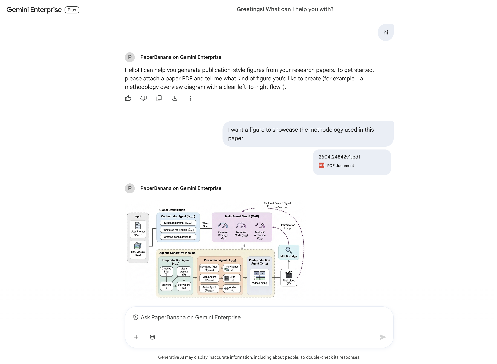

# PaperBanana on Gemini Enterprise (lite)

A small Google ADK agent that brings a *lite* version of [PaperVizAgent](https://github.com/google-research/papervizagent) — Google Research's reference-driven multi-agent framework for automated academic illustration (originally published as **PaperBanana**, the name we kept in the display label) — to the [Gemini Enterprise app](https://cloud.google.com/products/gemini/enterprise) via [Agent Runtime](https://docs.cloud.google.com/gemini-enterprise-agent-platform/scale).

A user attaches a paper PDF in the GE composer and chats about what figure they want; the pipeline plans → stylizes → renders → critiques → refines a publication-style diagram. Follow-up turns ("use a softer palette", "make the encoder boxes bigger") iterate on the result *in edit mode* — the visualizer feeds the prior render back in, so refinements are local rather than re-renders.



> **This is a lite demo, not the full system.** Please refer back to the [upstream PaperVizAgent repo](https://github.com/google-research/papervizagent) for the complete framework — Retriever (few-shot retrieval over PaperBananaBench), statistical-plot mode (matplotlib code-execution), the multi-candidate parallel pipeline, and the high-resolution Polish stage. **If you find the technique useful, please cite the PaperBanana paper (BibTeX below) and contribute to the upstream project.**

## Attribution & credits

This agent is a derivative work of Google Research's [PaperVizAgent](https://github.com/google-research/papervizagent) (Apache-2.0). All four system prompts in [`prompts.py`](prompts.py) are adapted verbatim from the corresponding PaperVizAgent files (with attribution headers in-file calling out the modifications), and [`style_guide.md`](style_guide.md) is a verbatim copy of PaperVizAgent's `neurips2025_diagram_style_guide.md`. See [`NOTICE`](NOTICE) for the full Apache-2.0 attribution.

**Authors of the PaperBanana paper / PaperVizAgent framework:** Dawei Zhu, Rui Meng, Yale Song, Xiyu Wei, Sujian Li, Tomas Pfister, Jinsung Yoon.

```bibtex
@article{zhu2026paperbanana,
  title={PaperBanana: Automating Academic Illustration for AI Scientists},
  author={Zhu, Dawei and Meng, Rui and Song, Yale and Wei, Xiyu and
          Li, Sujian and Pfister, Tomas and Yoon, Jinsung},
  journal={arXiv preprint arXiv:2601.23265},
  year={2026}
}
```

This is not an officially supported Google product. This project is intended for demonstration purposes only — not for use in a production environment.

## How it works

The pipeline is wired with ADK's workflow agents (`SequentialAgent` + `LoopAgent`) and exposed to the conversational root agent as a single `AgentTool` — that shape keeps Gemini Enterprise's "render only the first model event of a turn" constraint happy (the same constraint the [Model Garden agent](../model-garden-on-gemini-enterprise/README.md) had to design around).

```
root_agent (Gemini 3, conversational)
  │   before_model_callback : reattach uploaded PDF (GE strips file bytes)
  └── tool: PaperBananaPipeline   (AgentTool)
        SequentialAgent
          │── PrepInputs       stage tool args + previous-turn snapshot in state
          │── Planner          LlmAgent  → state["description"]
          │── Stylist          LlmAgent + style_guide  → state["styled_description"]
          │── LoopAgent(N=3)
          │     │── Visualizer   gemini-3-pro-image
          │     │                  (multimodal: prior image as edit input)
          │     │                  saves figure_{turn_id}_v{round}.png as artifact
          │     │── Critic       LlmAgent (vision)  → JSON {critic_suggestions, revised_description}
          │     `── CriticDecision  parses verdict; escalates loop on
          │                          "no changes needed", otherwise rolls
          │                          revised_description into state for next round
          `── Finalize         emits a summary referencing the saved figure
```

Mapping to PaperVizAgent:

| PaperVizAgent agent | This port | Notes |
| --- | --- | --- |
| Retriever | _skipped_ | No PaperBananaBench shipped; few-shot examples → upgrade hook in §"Extending" |
| Planner | `PaperBananaPlanner` | `DIAGRAM_PLANNER_AGENT_SYSTEM_PROMPT` ported verbatim |
| Stylist | `PaperBananaStylist` | `DIAGRAM_STYLIST_AGENT_SYSTEM_PROMPT` + `neurips2025_diagram_style_guide.md` ported verbatim |
| Visualizer | `PaperBananaVisualizer` | Uses `gemini-3-pro-image` natively — feeds the prior round's image back in for true edit-mode refinement (PaperVizAgent's text-only re-render works here too but loses continuity) |
| Critic | `PaperBananaCritic` + `PaperBananaCriticDecision` | `DIAGRAM_CRITIC_AGENT_SYSTEM_PROMPT` ported; same JSON schema |
| Polish (2K/4K upscale) | **native, on by default** | Nano Banana Pro generates at 4K natively (`ImageConfig(image_size="4K")`); set `IMAGE_SIZE=2K` or `1K` in `.env` for faster iteration |

## Prerequisites

1. A Google Cloud project with billing enabled
2. A [Gemini Enterprise](https://cloud.google.com/products/gemini/enterprise) subscription (for the GE registration step — local testing works without)
3. [Agent Platform API](https://console.cloud.google.com/apis/library/aiplatform.googleapis.com) and [Discovery Engine API](https://console.cloud.google.com/apis/library/discoveryengine.googleapis.com) enabled
4. [Cloud Resource Manager API](https://console.developers.google.com/apis/api/cloudresourcemanager.googleapis.com/overview) enabled
5. Access to the `gemini-3.1-pro-preview` and `gemini-3-pro-image` models (both served from the `global` endpoint)
6. [gcloud CLI](https://cloud.google.com/sdk/docs/install) installed
7. Python 3.10+

## Setup

```bash
# From: applications/pharma-on-gemini-enterprise/paperbanana-on-gemini-enterprise/
uv sync

cp .env.example .env
# then fill in GOOGLE_CLOUD_PROJECT in .env

gcloud auth login
gcloud auth application-default login
gcloud config set project YOUR_PROJECT_ID
```

`.env` (this file is **gitignored**):

```
GOOGLE_GENAI_USE_ENTERPRISE=1
GOOGLE_CLOUD_PROJECT=YOUR_PROJECT_ID
GOOGLE_CLOUD_LOCATION=us-central1
MODEL_LOCATION=global
PLANNER_MODEL_NAME=gemini-3.1-pro-preview
IMAGE_MODEL_NAME=gemini-3-pro-image
IMAGE_SIZE=4K            # Nano Banana Pro: 1K, 2K, or 4K
MAX_CRITIC_ROUNDS=3
```

## Project layout

```
paperbanana-on-gemini-enterprise/
├── pyproject.toml         # build configuration & dependencies
├── agents-cli-manifest.yaml # manifest pointing to app directory
├── uv.lock                # resolved dependencies
├── README.md              # main documentation (this file)
├── .env.example           # environment variables template
├── terraform/             # Terraform deployment configuration (calling shared module)
│   ├── main.tf
│   ├── variables.tf
│   └── outputs.tf
└── app/                   # Agent source code
    ├── __init__.py
    ├── agent.py           # root LlmAgent + Sequential / LoopAgent pipeline
    ├── prompts.py         # planner / stylist / critic / visualizer system prompts
    ├── style_guide.md     # NeurIPS-style guide
    ├── agent_runtime_app.py
    └── app_utils/
        ├── telemetry.py
        └── typing.py
```

## Test locally

```bash
uv run adk web app
```

Open the URL `adk web` prints (default `http://localhost:8000`), pick `app` (or `root_agent`), attach a paper PDF in the composer, and ask:

> *"Generate a methodology overview diagram with a clear left-to-right flow."*

Watch the **Events** tab on the right to see the pipeline fire (PrepInputs → Planner → Stylist → Visualizer → Critic → CriticDecision × N → Finalize). On the next turn, ask for a refinement:

> *"Use a softer pastel palette and add a 'frozen' snowflake icon on the encoder."*

The Visualizer picks up the prior figure as edit input (via `_S_PREV_TURN_IMAGE` state) and returns a refined render rather than starting from scratch.

## Deploy to Agent Runtime

You can deploy the agent directly using `agents-cli deploy` from this directory. The CLI will automatically package the agent code in the `app` directory and generate the necessary requirements from `pyproject.toml` and `uv.lock`.

```bash
uv run agents-cli deploy \
    --project=$PROJECT_ID \
    --region=us-central1 \
    --service-name="PaperBanana on Gemini Enterprise" \
    --deployment-target=agent_runtime
```

### Deploy with Terraform & Cloud Build (Recommended for Production)

For production, you can use the shared Terraform and Cloud Build configuration.

You can trigger the deployment using `gcloud builds submit` pointing to the shared configuration.

#### Deploy only:
```bash
# Run from the parent pharma-on-gemini-enterprise directory:
# applications/pharma-on-gemini-enterprise/

gcloud builds submit --config=shared/cloudbuild.yaml \
    --substitutions=_AGENT_DIR="paperbanana-on-gemini-enterprise",_TF_STATE_BUCKET="YOUR_STATE_BUCKET_NAME",_ENV_VARS="GOOGLE_API_PREVENT_AGENT_TOKEN_SHARING_FOR_GCP_SERVICES=false" \
    --project=YOUR_PROJECT_ID
```

#### Deploy and Register with Gemini Enterprise:
```bash
# Run from the parent pharma-on-gemini-enterprise directory:
# applications/pharma-on-gemini-enterprise/

gcloud builds submit --config=shared/cloudbuild.yaml \
    --substitutions=_AGENT_DIR="paperbanana-on-gemini-enterprise",_TF_STATE_BUCKET="YOUR_STATE_BUCKET_NAME",_ENV_VARS="GOOGLE_API_PREVENT_AGENT_TOKEN_SHARING_FOR_GCP_SERVICES=false",_GEMINI_ENTERPRISE_APP_ID="projects/YOUR_PROJECT_ID/locations/global/collections/default_collection/engines/YOUR_APP_ID" \
    --project=YOUR_PROJECT_ID
```

#### Customizing Environment Variables (Optional):
To override default environment variables (e.g. set `IMAGE_SIZE=2K` for faster iteration or change the max critic rounds), pass the `_ENV_VARS` substitution (semicolon-separated) to `gcloud builds submit`:
```bash
gcloud builds submit --config=shared/cloudbuild.yaml \
    --substitutions=_AGENT_DIR="paperbanana-on-gemini-enterprise",_TF_STATE_BUCKET="YOUR_STATE_BUCKET_NAME",_ENV_VARS="IMAGE_SIZE=2K;MAX_CRITIC_ROUNDS=2;GOOGLE_API_PREVENT_AGENT_TOKEN_SHARING_FOR_GCP_SERVICES=false" \
    --project=YOUR_PROJECT_ID
```

#### Verify

Open Gemini Enterprise, pick **PaperBanana on Gemini Enterprise** from the sidebar, attach a paper PDF in the composer, and ask for a figure. You should see a result like the screenshot at the top of this README. Note: the pipeline takes ~30–60 seconds per turn (planner + stylist + N × visualizer + N × critic) — GE shows a single spinner for the duration.

## Extending

A few principled next steps if you want to push this beyond a lite demo:

- **Re-add the Retriever.** Download [PaperBananaBench](https://huggingface.co/datasets/dwzhu/PaperBananaBench) (or curate your own reference figure pool), index it with embeddings, and add a `retrieve_examples` `FunctionTool` invoked before the Planner. PaperVizAgent's [`agents/retriever_agent.py`](https://github.com/google-research/papervizagent/blob/main/agents/retriever_agent.py) is the reference implementation.
- **Add statistical-plot mode.** PaperVizAgent's plot path generates matplotlib code instead of an image; mount the optional code-execution sandbox from the [model_garden_agent](../../model-garden-on-gemini-enterprise/model_garden_agent/README.md#optional-code-execution) to run that code inside the Vertex AI sandbox.
- **Tweak the resolution / aspect ratio.** Visualizer renders at 4K by default (`IMAGE_SIZE=4K`); pass `2K` or `1K` for faster iteration. To pin an aspect ratio, add `aspect_ratio="16:9"` (or `"4:3"`, `"1:1"`, etc.) to the `ImageConfig` in `_build_visualizer_request` — Nano Banana Pro will respect it.
- **Parallel candidates.** PaperVizAgent fans out 5–20 candidates per query and lets the user pick. Wrap `paperbanana_pipeline` in a `ParallelAgent` and emit a gallery in the Finalize step.

## Disclaimer

This is not an officially supported Google product. See [NOTICE](NOTICE) for the full Apache-2.0 attribution stack. Use for research and demo purposes only — not for production deployment.
